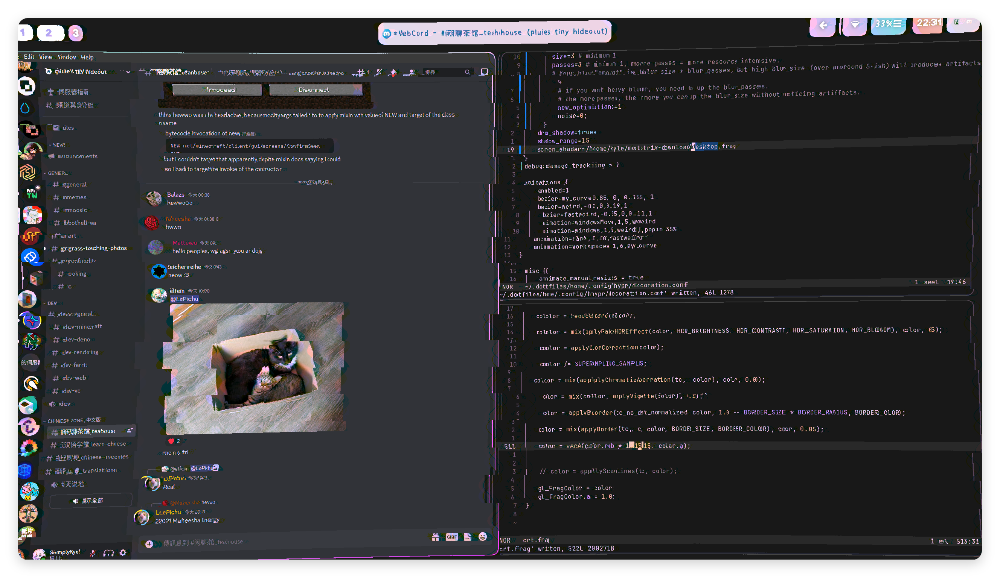

- # Golden Age - Rin Penrose(English learning)
  collapsed:: true
  {{video https://www.youtube.com/watch?v=c7Kh0ie2Ots}}
	- splendour -> 輝煌
	- renaissance -> 文藝復興
	- endeavour -> 努力
	- chronicle -> 編年體
	- unto = to
	- sovereign -> 主權
	- eminence -> 閣下、顯赫
	- chance lies on the precipice of hope and time -> 機會是在希望與時間的懸崖上
	  id:: 64cb6fd0-6980-47d6-a7bd-4445e7c725ca
	- aspiration -> 願景
	- weary -> 厭倦
	- betwixt = between
	- seized the day -> 把握光陰
	- Aundente fortuna iuvat => Fortune favours the bold
	- heed -> 注意
	- envelop -> 籠罩
	- E'en = even
	- O'er = over
	- repose = rest -> 休息
- Today I found this VTuber called Rin Penrose, and wow do I like her voice. The way she speaks, the clearness, the speed, even the accent. She's just so fascinating.
- oh my god, end4 shared a really [crazy shader](https://cdn.discordapp.com/attachments/1088009063306100756/1088079192710713436/desktop.frag)
	- {:height 441, :width 748}
- I should really find a way to fix my sleeping schedule.
- Forge is annoying as hell(https://github.com/modrinth/theseus/blob/master/theseus/src/launcher/mod.rs for future me reference).
- [[Aug 4th, 2023]]
	- Do Summer homework