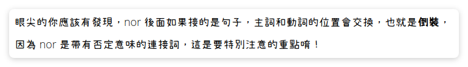

- The culprit is... `${version_name}.jar`. Surprisingly, it isn't the version of Minecraft, nor is it the version of Forge. It's actually what the launch jar is!
  Man at least give me some documentation man, this is annoying.
	- (interesting grammar time)
	- 
- Other than that, forge turned out to be not *as* bad as I've set it out to be. Thanks for modrinth giving that meta file, it's relatively simple to parse.
- ## Words of the day
	- misnomer :<-> 使用不當的名字
		- It's a bit of a misnomer.