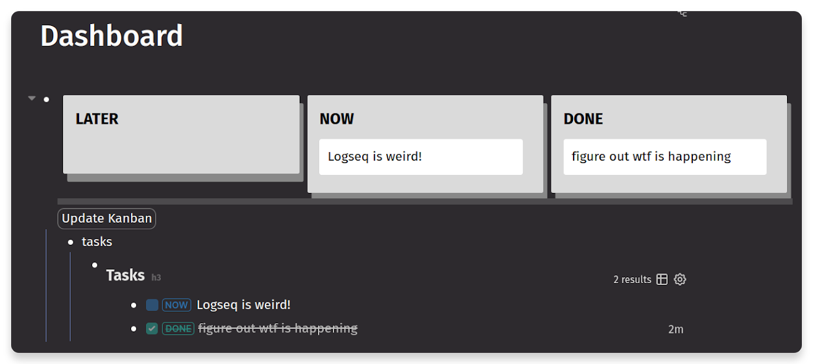

- Kanban looks soo good!
  query-table:: false
	- 
- LATER Use error-chain instead of anyhow to propagate errors
  :LOGBOOK:
  CLOCK: [2023-08-08 Tue 11:08:42]
  :END:
-
- # Words of the day #daily_words
	- propagate :-> 傳播
	- push comes to shove :-> 一旦情況緊急，不得已時
	  extra:: If push comes to shove, we can always sell the car.