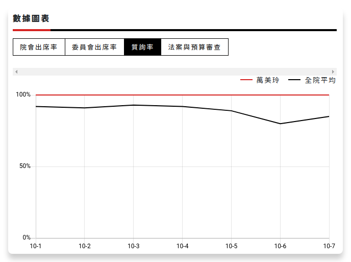
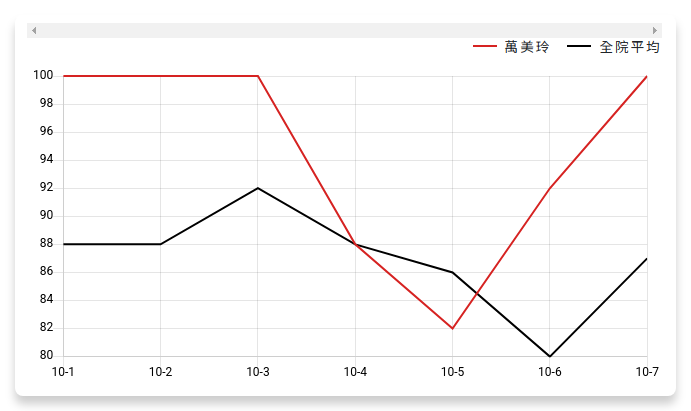

# 學經歷
	- 美國明尼蘇達州立曼徹普立敦大學
		- 曾有學歷爭議，不過應為炒作
			- > https://udn.com/news/story/7324/7572864
			- 范綱祥指控 -> **明尼蘇達州立曼徹普立敦大學的學士學位**，是沒有辦法通過教育部採認標準的假學歷。
			- 回應 -> 的確在 教育部認可外國大學名冊 上
- # 監督質詢
	- > https://ccw.org.tw/assess/34/legislator/398
	- 
	- 
- # 政見
	- ## 2020 政見
		- 主要闡述 **教育**
		- 實際政見
			- **教育**不能亂 建設不能慢
			- [**部分**實現] 爭取三歲幼兒就讀公立幼兒園小班免費，私立補助 15,000 元。
			  collapsed:: true
				- 實際狀況
				- 
			- [**部分**實現] 提高公幼比例、降低師生比，提高托育品質。
			  collapsed:: true
				- 資料來源
				  collapsed:: true
					- https://depart.moe.edu.tw/ed4500/cp.aspx?n=1AC243AF6EF5E5DD&s=EDC4A4E717ED32CF
				- 2020 公幼 4.5 成 -> 4.8 成
					- 
					- 
				- 師生比 持平
					- | 統計期 |設立別|國小|中等教育|國中|高級中等學校|大專校院|
					  | 109學年 | 總計 | 12.11 | 12.07 | 9.69 | 14.22 | 21.73 |
					  | 109學年 | 公立 | 11.94 | 10.60 | 9.66 | 11.79 | 18.80 |
					  | 109學年 | 私立 | 19.27 | 20.10 | 13.63 | 20.29 | 24.02 |
					  | 111學年 | 總計 | 12.20 | 11.57 | 9.28 | 13.63 | 21.53 |
					  | 111學年 | 公立 | 12.04 | 10.17 | 9.25 | 11.29 | 19.24 |
					  | 111學年 | 私立 | 19.38 | 19.90 | 12.82 | 20.14 | 23.46 |
			- [wtf?] 檢視 108 課綱，讓學習歷程檔案更有彈性，真正落實多元學習。
			- [實現] 健全 12 年國教，使技職教育專業化，落實實習生受勞基法保障。
				- 為 高級中等學校建教合作實施及建教生權益保障法第二十一／二十三條條文修正草案 之 首位提案人
				- https://www.edu.tw/News_Content.aspx?n=9E7AC85F1954DDA8&s=4D886A3C0BE1697C
					- > 明定建教生基礎或職前訓練應包括勞動權益課程，並由教育部會商中央勞工主管機關訂定最低時數、每年檢討修訂勞動人權及勞動權益手冊(修正條文第11條)；增訂中央勞工主管機關得辦理建教合作機構勞動檢查。(修正條文第29條)
			- [實現] 推動各校雙語及 AI 教學環境，提升未來國際競爭力。
				- 懶得找，不過肯定有
			- [實現] 落實班班有冷氣政策，檢討台電契約容量，減輕學校電費壓力。
				- 懶得找，不過肯定有
			- [找不到相關報導] 爭取老舊校舍更新經費，改善教育環境。
			- [**部分**實現]  學貸全面免息，減輕年輕學子壓力。
				- > https://www.cna.com.tw/news/ahel/202401050133.aspx
				- 配合支持生育政策，除放寬申貸家庭年所得門檻外，亦納入撫育子女數考量，且就學期間全面免付利息全數由政府支應。
				- （一）家庭年所得120萬元以下：在學期間免利息。
				- （二）申貸學生及其兄弟姐妹或學生及其子女數有2名者(含未成年或已成年在學階段)，則家庭年所得放寬至148萬元以下均可申貸，在學期間免利息。
				- （三）申貸學生及其兄弟姐妹或學生及其子女數有3名者(含未成年或已成年在學階段)，則不限家庭年所得均可申貸，在學期間亦免利息。
				- （四）未符前述資格，但申貸學生及其兄弟姐妹或學生及其子女數有2名者(含未成年或已成年在學階段)：利息自付。
			- 9. 督促桃園社會住宅加速興建，爭取就業青年房租補助門檻降低，建置青年就業媒合
			  平台。
				- https://estate.ltn.com.tw/article/9655
				  https://www.myhousing.com.tw/real-estate-news/estate-news-all/north-taiwan/taoyuan-estate/128447/
				  https://news.ltn.com.tw/news/Taoyuan/paper/1459334
					- 2020 -> 兩個
					- 2024 -> **慈文安居** + 龜山善捷、中興段社宅
- # 得票率分析
	- https://votetw.com/wiki/%E8%90%AC%E7%BE%8E%E7%8E%B2
	- 2020 -> 49.11% (主要對手 46.5)
	- 2018 -> 12.62% (桃園市議員，大贏第二的 7.58% )
	- ## 對手分析
		- 2009 市長 -> 46.64%