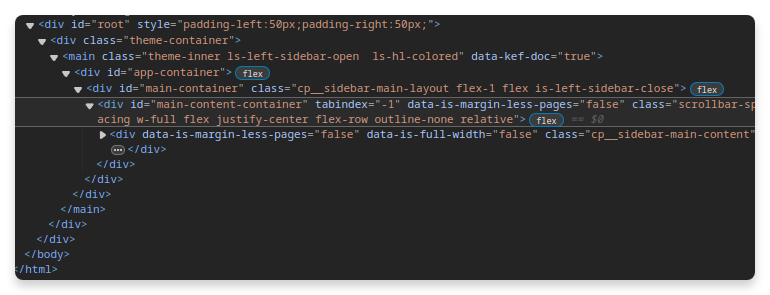

# [[Rust 2 C++]]
- # Fix Logseq Printing
	- prints html, modify so that it has `is-left-sidebar-close` instead of `is-left-sidebar-open`
	- and adds the style `padding-left:50px;padding-right:50px;`
	- 