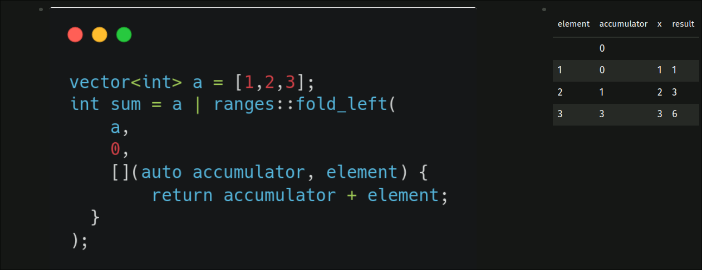

# 程式設計典範
	- ## Procedural Programming
	  id:: 671267b9-aae8-45cd-8b3a-4eb37b055d1a
		- 一種基於過程和子程序的編程典範，強調按**順序執行一系列計算步驟**。
		- 經典例子：**C**
		- ```cpp
		  int sumProcedural(const std::vector<int>& numbers) {
		      int total = 0;
		      for (int num : numbers) {
		          total += num;
		      }
		      return total;
		  }
		  ```
	- ## Object Oriented Programming
		- 一種基於**物件**概念的編程典範，通過**封裝**數據和行為到**物件**中來組織代碼。
		- ```cpp
		  class NumberList {
		  private:
		      std::vector<int> numbers;
		  
		  public:
		      NumberList(const std::vector<int>& nums) : numbers(nums) {}
		  
		      int calculateSum() const {
		          return std::accumulate(numbers.begin(), numbers.end(), 0);
		      }
		  };
		  ```
	- ## Functional Programming
		- 一種將計算視為**數學函數**評估的編程範式，強調**不可變性**和避免**副作用**。
		- #+BEGIN_TIP
		  何謂副作用？除了返回一個值之外，還對**程式狀態**產生了其他的影響，以下是例子：
		  - 修改傳入的參數
		  - 拋出異常
		  #+END_TIP
		- ```cpp
		  auto sumFunctional = [](const std::vector<int>& numbers) {
		      return std::accumulate(numbers.begin(), numbers.end(), 0);
		  };
		  ```
	- ## **Collection** Oriented Programming
		- 是 Functional Programming 內的子集，目標在於盡量用容器（Collection）來達成目的，一樣強調盡量避免**可變性**。
		- 主要是強調**整體操作**而非逐個元素的處理，利用各類高階函數(transform, filter, reduce) 達成集合的處理。
		- 希望形成編碼形式就是的就是 -- code 即是注釋，注釋就是 code
		- ```cpp
		  // 本次要介紹的就是! 請往下看
		  ```
- # 簡介
	- ## Ranges
		- **一大坨可迭代元素的集合**，大部分 STL 的容器都是一種 Range
	- ## Views
		- 為一種 **視圖**，可以想像成一種特殊的只讀 sub-range
		- 所以，任何 range 同時也是 views
	- ## Views adapter
		- 可將 Views 內的元素，進行各類的轉換，轉換後仍然是一種 **Views**
		- 可利用 `pipe |` operator 進行串接
	- 以上概念，都被包括在 `#include <ranges>` 裡面
- # 如何創建 range?
	- 更標準的說法，**Range Factory** - **範圍工廠**
	- ## Range 的 `for` 迴圈語法
		- `for(auto x: [range]) { .. }`
		- 創建一個變數，從 range 裡面迭代過去
	- ## `std::vector`
		- 沒錯! vector 本身也是一種 range!（畢竟她也是 STL 容器）
		- ```cpp
		  vector<int> v = {1,3,4,5};
		  for (auto x: v) {
		    std::cout << x << ' ';
		  }
		  // 1 3 4 5
		  ```
	- ## `std::views::iota`
		- 用法 `std::views::iota(from, to)`
		- `std::views::iota(1, 11)` 創建一個 Range，從 1 到 10
		- ```cpp
		  for (int i: std::views::iota(1, 11)) {
		    std::cout << i << ' ';
		  }
		  // 1 2 3 4 5 6 7 8 9 10
		  ```
- # Views adapters
	- 先介紹一些經典的 adapters（在 C++ 20 推出的）
	- 後半部則是較新穎（在 C++ 23 才推出的）adapters
	- ## 術語
		- `func`：在此教材中，指的是任意的**可呼叫物件**，可以是 lambda function、函式指針
			- **可呼叫物件**是任何可以用此語法 `x()` 呼叫的物件
			- 不會 **lambda function** ? 以下是用法簡介
				- lambda function 就是**匿名函數**，但可以直接存取非在其 scope 底下的變數，語法如下
				- （如果想詳細了解 capture by value 與 by reference 的差異，請先確保你理解 [[指標與參考]]）
				  collapsed:: true
					- > Capture By Value -  是普通函式的預設行為，會將所有用的值，**複製**一份到 lambda 裡面
					- > Capture By Reference - 會讓所有使用這個 lambda 的地方，**共用一塊記憶體**，形同參考
				- ```cpp
				  int one = 1;
				  
				  // 中括號內的 `&` 在此指 capture by reference，可替換成 `=` 來表達 capture by value。
				  // 小括號的是此 lambda 的參數，如同普通函式一般，可以有無限量的參數數量
				  int func = [&] (int x) {
				    	return one + x;
				  };
				  
				  cout << func(3) << func(7) << func(2); // 利用 `()` 來呼叫，可重複呼叫
				  // 4 8 3
				  ```
	- ## 經典
		- ### `std::views::transform(func)`
			- 意義：將每個元素，到「**轉換**(transform)」成一個新的型別/數值。
			- #### `func` 的定義
				- 接受參數：原 range 每個元素的型別
				- 回傳型別：目標數值的型別
			- #### 例
			- ```cpp
			  int calculate(vector<int> v) {
			    	auto iter = v | views::transform([](auto x) {
			        	return std::to_string(x) + std::to_string(x*x);
			      });
			    	for (auto element: iter) {
			        	cout << element << ' ';
			      }
			  }
			  ```
		- ### `std::views::filter(func)`
			- 意義：將 range 內的元素「**過濾**(filter)」到只剩符合 `func` 描述的限制時。
			- #### func 的意義
				- 接受參數：原 range 每個元素的型別
				- 回傳型別：bool
			- #### 例
			- ```cpp
			  int calculate(vector<int> v) {
			    	auto iter = v | views::filter([](auto x) {
			        	return x % 2 == 0 && x > 48;
			      });
			      for (auto element: iter) {
			         	cout << element << ' ';
			      }
			  }
			  ```
		- ### `std::views::take(int)`
			- 意義：把 range 前 N 個元素給取出來
			- #### 例
			- ```cpp
			  int calculate() {
			    	for (auto x: views::iota(8,24) | views::take(5)) {
			        	cout << x << ' ';
			      }
			  }
			  ```
		- ### `std::views::enumerate`
			- 意義：將 range 的 index 給「**枚舉**(enumurate)」出來
			- 如果要輸出 vector 裡的每個元素，有兩種方法。
				- 傳統 for loop
					- ```cpp
					  vector<string> v = {"a", "b", "c", "d"}
					  
					  for(int i = 0; i<v.size() ;i++) {
					    	cout << v[i] << " ";
					  }
					  ```
				- for range
					- ```cpp
					  vector<string> v = {"a", "b", "c", "d"}
					  
					  for(int x: v) {
					    	cout << x << " ";
					  }
					  ```
			- 如果**同時要輸出** index 則只能使用傳統 for loop
			- `views::enumerate` 將每個元素的型別轉換成 enumerate_result
				- ```cpp
				  struct enumerate_result {
				      Index index;
				      Value value;
				  };
				  ```
			- 有了 `views::enumerate` 之後，就可以做以下動作
				- ```cpp
				  vector<string> v = {"a", "b", "c", "d"}
				  
				  
				  for (auto result: vec | std::views::enumerate) {
				  	cout << result.index << ": " << result.value << '\n';
				  }
				  
				  // 這種方式叫做 `de-structring`，可以叫方便的獲取
				  for(auto [index, element]: v | views::enumerate) {
				    	cout << index << ": " << element << '\n';
				  }
				  ```
		- ### `std::views::chunk(int)`
	- ## 進階
		- ### `std::views::chunk_by(func)`
		- ### `std::ranges::to<STL_CONTAINER>()`
			- 能將 ranges 轉成 STL 容器
			- 注意，`STL_CONTAINER` 不必拼出完整型別，只需拼出 container 即可
			- #### 不正確
				- ```cpp
				  vector<string> v = {"a", "b", "c", "d"};
				  auto indexed_vector = v 
				      | views::enumerate 
				      | views::transform([](auto p) {
				          auto [index, element] = p;
				          pair<int, string> x = {index, element};
				          return x;
				      }) 
				      | ranges::to<vector<pair<int, string>>>();
				  ```
			- #### 正確
				- ```cpp
				  vector<string> v = {"a", "b", "c", "d"};
				  
				  auto indexed_vector = v 
				  	| views::enumerate 
				      | views::transform([](auto p) {
				          auto [index, element] = p;
				          pair<int, string> x = {index, element};
				          return x;
				      })
				      | ranges::to<vector>();
				  ```
		- #### 最佳
			- ```cpp
			  auto indexed_vector = v | views::enumerate | ranges::to<vector>();
			  ```
- # Ranges algorithms
	- #+BEGIN_IMPORTANT
	  跟 Views adapters 差在輸出**不能**使用 `|` 來串接。
	  有時甚至輸出的連 range 都不是。
	  #+END_IMPORTANT
	- ## `std::ranges::size`/`std::ranges::distance`
	- ## `std::ranges::all_of(range, func)`/`std::ranegs::any_of(range, func)`
		- ```cpp
		  vector<int> v = {1,2,3,4,5,6,7,8};
		  
		  bool f = ranges::all_of(
		      v,
		      [](auto ele) {
		        	return ele % 2 == 0;
		      }
		  );
		  
		  bool g = ranges::any_of(
		      v,
		      [](auto ele) {
		        	return ele % 2 == 0;
		      }
		  );
		  ```
		- ranges::all_of
	- ## `std::ranges::fold_left(range, value, func)`
		- 可以視為，有著「記憶」的 for loop
		- 結果：把所有 elements 給 「折起來」"fold" 成一個數值
		- {:height 391, :width 995}
		- ```cpp
		  vector<int> v = {1,2,3,4,5};
		  
		  string s = ranges::fold_left(
		      v,
		      "0",
		    	[](auto acc, auto ele) {
		          return std::format("({} + {})", acc, ele); 
		        	// 與 `printf("(%s, %d)", acc, ele) 類似
		      }
		  );
		  ```
		- ```
		  (((((0 + 1) + 2) + 3) + 4) + 5)
		  ```
		- ```cpp
		  vector<int> v = {1,2,3,4,5};
		  
		  std::string target = "0";
		  for (auto x: v) {
		      target = std::format("({} + {})", target, x);
		  }
		  ```
		- #### `std::funcitonal`
			- 有很多好用的物件，如：
				- `std::plus{}` == `[](auto a,auto b) { return a+b })`
				- `std::minus{}` == `[](auto a, auto b) { return a-b })`
				- `std::multiplies{}` == `[](auto a, auto b) { return a*b })`
				- `std::divides{}` == `[](auto a, auto b) { return a/b })`
			- 與 fold_left 合用如下
			- ```cpp
			  vector<int> v = {1,2,3};
			  int sum = a | ranges::fold_left(
			      v,
			      0,
			      std::plus{}
			  );
			  ```
- # 題目練習
	- #+BEGIN_IMPORTANT
	  要注意，因為多數競程平台（甚至 IDE）都尚不支援 C++ 23 標準
	  將你的程式碼丟上去會編譯失敗!
	  #+END_IMPORTANT
	- https://zerojudge.tw/ShowProblem?problemid=o076
		- collapsed:: true
		  #+BEGIN_TIP
		  官方解答
		  #+END_TIP
			- ```cpp
			  int n;
			  cin >> n;
			  vector<int> height(n);
			  for (auto &x: height) {
			      cin >> x;
			  }
			  cout << ranges::max(height
			      | views::chunk_by(std::ranges::greater_equal{})
			      | views::transform(ranges::size));
			  ```
	- 給與你一串陣列，告訴我有多少個個數字是小於零的
		- collapsed:: true
		  #+BEGIN_TIP
		  官方解答（一）
		  #+END_TIP
			- ```cpp
			  int count_negatives(vector<int> xs) {
			      return ranges::distance(
			          xs | views::filter([](auto element) { return element < 0;})
			      );
			  }
			  ```
		- collapsed:: true
		  #+BEGIN_TIP
		  官方解答（二）
		  #+END_TIP
			- ```cpp
			  int count_negatives(vector<int> xs) {
			      return ranges::count_if(xs,
			          [](auto element) { return element < 0;}
			      );
			  }
			  ```
	- 給與你一串陣列，告訴我小於零的數字的總和是多少
		- collapsed:: true
		  #+BEGIN_TIP
		  官方解答
		  #+END_TIP
			- ```cpp
			  int sum_negative_numbers(vector<int> xs) {
			      return ranges::fold_left(
			          xs | views::filter([](auto element) { return element < 0;}),
			          0,
			          std::plus{}
			      );
			  }
			  ```
	- 給與你 `string`，返回 `vector<char>`
		- collapsed:: true
		  #+BEGIN_TIP
		  官方解答
		  #+END_TIP
			- ```cpp
			  vector<char> string_to_vec_char(string str) {
			      return str | ranges::to<vector>();
			  }
			  ```
	- 將字串反轉
		- 會用到這個，請嘗試自行閱讀，並且使用（建議滑到下面，直接看 examples 比較快）
		- https://en.cppreference.com/w/cpp/ranges/reverse_view
		- collapsed:: true
		  #+BEGIN_TIP
		  官方解答
		  #+END_TIP
			- ```cpp
			  string reverse_string(string str) {
			      return str | views::reverse | ranges::to<string>();
			  }
			  ```
	- 將下列 for loop ，轉換成利用 ranges and views 來解決
		- ```cpp
		  int calculate(int bottom, int top) {
		    	int sum = 0;
		    	for(int number = bottom; number<=top; number++) {
		        	if (number % 2 == 0) {
		            	sum += number;
		          }
		      }
		    	return sum;
		  }
		  ```
		- collapsed:: true
		  #+BEGIN_TIP
		  官方解答
		  #+END_TIP
			- ```cpp
			  int sum_lists_evens(int bottom, int top) {
			      auto even = [](auto element) { return element % 2 == 0; };
			      return ranges::fold_left(
			          views::iota(bottom, top+1) | views::filter(even),
			          0,
			          std::plus{}
			      );
			  }
			  ```
	- 確認是否所有元素皆大於前一個元素（遞增數列）
	  id:: 67127e91-a5e0-4ea9-a2c7-962557f22313
		- 快速介紹 `std::views::pairwise`
			- 將原始元素，替換成相鄰兩元素，例：
			- ```cpp
			  std::vector<int> numbers = {1, 2, 3, 4, 5, 6};
			  
			  for (auto [a, b]: numbers | views::pairwise) {
			    	cout << std::format("({},{})", a, b) << ' ';
			  }
			  
			  // (1,2) (2,3) (3,4) (4,5) (5,6)
			  ```
		- collapsed:: true
		  #+BEGIN_TIP
		  官方解答
		  #+END_TIP
			- ```cpp
			  bool increasing_array(const std::vector<int>& xs) {
			      return std::ranges::all_of(xs | views::pairwise, 
			          [](auto t) {
			              auto [x,y] = t;
			              return x < y;
			          });
			  }
			  ```