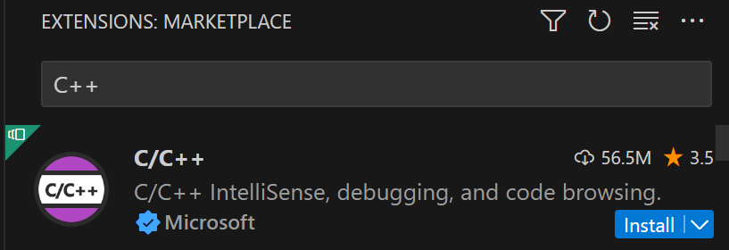
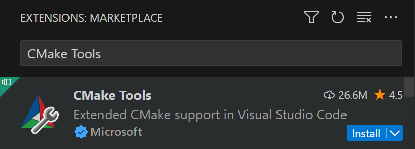

- 我們將利用 [[scoop]] 與 [[vcpkg]] 來安裝函式庫，並利用 CMake 來在我們的 C++ 專案中使用
- ### 1. 安裝 scoop
	- 開啟命令列（Win + R, 打 powershell）（或是 Windows Terimnal）
	- ```powershell
	  Set-ExecutionPolicy -ExecutionPolicy RemoteSigned -Scope CurrentUser
	  Invoke-RestMethod -Uri https://get.scoop.sh | Invoke-Expression
	  ```
- ### 2. 安裝 vcpkg 及其依賴
	- ```bash
	  scoop install vcpkg
	  scoop install ninja
	  scoop install mingw
	  ```
- ### 3.安裝 Visual Studio Code 延伸模組
	- 在 **擴充功能** 介面，安裝這兩個延伸模組
	- 
	- 
- ### 4. 創建 VSCode 專案
	- 1. 在專案資料夾裡運行
		- `vcpkg `
	- 2. 創建 `CMakeLists.txt` ，並寫入以下資料
		- ```cmake
		  cmake_minimum_required(VERSION 3.10)
		  
		  project(HelloWorld)
		  
		  add_executable(HelloWorld main.cpp)
		  ```
	- 3. 創建 `CMakePresets.json`，並寫入以下資料
		- ```json
		  {
		    "version": 2,
		    "configurePresets": [
		      {
		        "name": "vcpkg",
		        "generator": "Ninja",
		        "binaryDir": "${sourceDir}/build",
		        "cacheVariables": {
		          "CMAKE_TOOLCHAIN_FILE": "$env{VCPKG_ROOT}/scripts/buildsystems/vcpkg.cmake"
		        }
		      }
		    ]
		  }
		  ```
	- 4. 創建 `CMakeUserPresets.json`，並寫入以下資料
		- ```json
		  {
		    "version": 2,
		    "configurePresets": [
		      {
		        "name": "default",
		        "inherits": "vcpkg",
		        "environment": {
		          "VCPKG_ROOT": "$env{userprofile}/scoop/apps/vcpkg"
		        }
		      }
		    ]
		  }
		  ```
- ### 5. 編譯程式
	- 按下 **Ctrl + Shift + P**，並搜尋「CMake: Build」
		- 
	- `default`選取 CMake 預設
		- {:height 179, :width 1128}