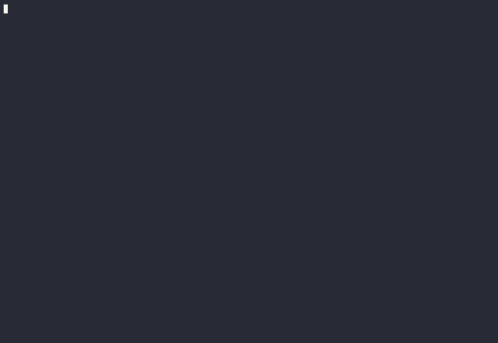

- {{renderer :tocgen2}}
- # Helix 簡介
	- Helix 編輯器的精髓在於其 **模態編輯** 的功能。
		- 模態編輯意旨：在輸入時，具有不同狀態
		- **正常**模式、**輸入**模式
- # 模式介紹
	- ## 輸入模式
		- 人如其名，在輸入模式之下，你能輸入文字。
		- [如何進到此模式](((67067ec9-5b12-4982-941c-d1b7f1105894)))？
	- ## 正常模式
		- 在此模式下，你 **無法輸入文字**
		- 你能做的只有告訴編譯器你要叫她做什麼**行動**
		- ### 基礎行動介紹
			- #### 將鼠標上下左右移動
				- `h` 向左，`l` 向右
				- `k` 向上，`j` 向下
				- 
				- #+BEGIN_TIP
				  你可能會想，為何要這樣設計，而不單純使用方向鍵呢？
				  他的目標即是讓你的手離 **Home Row** 越近越好。
				  #+END_TIP
			- #### 按下 `w` 使你的遊標選取**下**一個單字，按下 `b` 使你的遊標選取**上**一個單字
				- 
			- #### 按下 `d` 將選取之文字刪除
				- 
			- #### 按下 `x` 選取此行，連續按 `x` 可**繼續**選取
				- 
			- #### 進入輸入模式
			  id:: 67067ec9-5b12-4982-941c-d1b7f1105894
				- 按下 `i` 在鼠標目前位置進入輸入模式
				- 按下 `A` 在最後的位置進入輸入模式
				- #+BEGIN_IMPORTANT
				  要回到正常模式，請按 `Esc`
				  #+END_IMPORTANT
				- {:height 635, :width 714}
		- #### 按下 `:w` 儲存檔案，按下 `:q` 則會退出檔案，按下 `:wq` 則能儲存且退出檔案
			- #+BEGIN_IMPORTANT
			  若有**尚未儲存**的資料，無法以 `:q` 退出檔案
			  若執意退出，可以 `:q!` **強制退出**，拋棄更改的文字
			  #+END_IMPORTANT
			- 
		- ### 基礎行動介紹（補充）
			- 這段介紹的意義在於，提升效率，即使不使用這些快捷鍵也能達成一樣的效果。
			- #### 取代並輸入
				- 按下 `c` 等同於 `d` + `i`
				- 將**選取區域中的文字刪除**，並直接進入輸入模式
			- #### 選取直到一個字母
				- `t` + 該字母
			- #### 選取直到行末
				- `t` + `Enter`= `A` + `Esc`
				- 選取直到 `\n` = 從行末輸入，回到正常模式
		- ### 進階行動介紹
			- #### 暫存器
				- 在 **Helix** 中，有一個很重要的觀念
					- 當你把文字**刪除**時，Helix 會把那串文字放到一個 **暫存器** 內
				- 可利用 `y` 將選取的文字放入 **暫存器** 內
				- 按下 `p` 將**暫存器**中的的文字給複製出來
				- 
				- #+BEGIN_TIP
				  暫存器原文為：**Registers**
				  #+END_TIP
			- #### 多鼠標編輯
				- 按下 `C` 得以將你的鼠標**往下一行複製**一份
				- 按下 `,` 得以將你的鼠標重製為**只剩一個**
				- **批發更改** 是使用多鼠標編輯的一大好處
				- 
			- #### 選擇模式
				- 用於當你需批發更改的文字**不完全**在行與行之間，用選擇模式來創建**多鼠標環境**。
				- 用法：
					- 先找到你要**取代的**文字
					- 將這串文字**範圍**選取起來（利用重複打 `x`）
					- 按下 `s`，再打一串能完整識別這塊文字的字串
					- 按下 `d`、`i`，開始進入多鼠標編輯模式
				- 用途示範：（將 `ascent` 替換成 `descent`，並將所有的數值增加一個後綴零）
				- 
			- #### Surround 模式
				- 用於選擇各式「**可重複字元**」的選擇
				- #+BEGIN_TIP
				  何謂**可重複字元**？
				  `()` `{}` `[]` `""` `''` .....
				  各類可將字串「包覆」起來的字元
				  #+END_TIP
				- `mm` 移動遊標至對應的重複字元
					- 
				- `mi` + `字元`
					- 選擇 **可重複字元** 的裡面
					- 選擇括號 `mi(` or `mi)`
					- 選擇字串裡面 `mi"`
					- 
			- #### Space 模式（太空模式）
			  collapsed:: true
				- 我稱為 **IDE 模式**（具有很多方便的功能）
				- 不必背誦，有需要在按 `space` 得知詳細 short cuts
				- 讀取 documentation
					- `space` + `k`
					- 
				- 從系統剪貼簿複製與貼上
					- 複製 `space` + `y`
					- 貼上 `space` + `p`
					- 
			- #### Goto 模式
- # 安裝
	- 按下 `Win+R`，並複製以下命令
		- `powershell -c 'if (!(Get-Command scoop -ErrorAction SilentlyContinue)) { Set-ExecutionPolicy -ExecutionPolicy RemoteSigned -Scope CurrentUser; iex "& {$(irm get.scoop.sh)} -RunAsAdmin" }; scoop install helix clangd'`
- # 命令列簡介
	- 由於 `helix` 是命令列工具，所以你必須熟悉命令列，若不熟，以下是對命令列的簡介。
	- #+BEGIN_TIP
	  在此簡介中，`[folder]`/`[file]` 意旨檔案名稱/路徑
	  所以 `folder1/folder2` 、 `folder1/folder2/folder3/file.pdf` 跟 `file.pdf` 皆為合法意義
	  #+END_TIP
	- 瀏覽目前目錄下的檔案(ls)
		- `ls -l` 列出檔案
	- 移動目錄(cd)
		- cd .. `回到上一層
		- `cd [folder]`
	- 刪除檔案
		- `rm -r` 刪除目錄
		- `rm [file]` 刪除檔案
			- 例：刪除 file.pdf `rm file.pdf`
- # Playground
	- 下載此檔案，可以試試看各種功能。