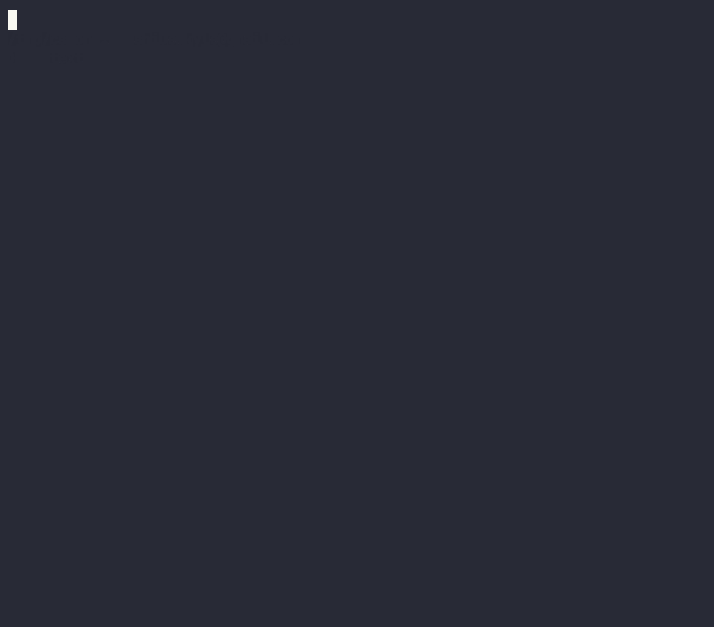

# Helix 簡介
	- Helix 編輯器的精髓在於其 **模態編輯** 的功能。
		- 模態編輯意旨：在輸入時，具有不同狀態
		- **正常**模式、**輸入**模式
- # 模式介紹
	- ## 輸入模式
		- 人如其名，在輸入模式之下，你能輸入文字。
		- [如何進到此模式](((67067ec9-5b12-4982-941c-d1b7f1105894)))？
	- ## 正常模式
		- 在此模式下，你 **無法輸入文字**
		- 你能做的只有告訴編譯器你要叫她做什麼**行動**
		- ### 基礎行動介紹
			- 將鼠標左右移動
				- `h` 向左，`l` 向右
				- `k` 向上，`j` 向下
				- 
				- #+BEGIN_TIP
				  你可能會想，為何要這樣設計，而不單純使用方向鍵呢？
				  他的目標即是讓你的手離 **Home Row** 越近越好。
				  #+END_TIP
			- 按下 `w` 使你的遊標**往後**選取一個字，按下 `b` 使你的遊標**往前**選取一個字
				- 
			- 按下 `d` 將選取之文字刪除
				- 
			- 按下 `x` 選取此行，連續按 `x` 可**繼續**選取
				- 
			- 進入輸入模式
			  id:: 67067ec9-5b12-4982-941c-d1b7f1105894
				- 按下 `i` 在鼠標目前位置進入輸入模式
				- 按下 `A` 在最後的位置進入輸入模式
				- #+BEGIN_IMPORTANT
				  要回到正常模式，請按 `Esc`
				  #+END_IMPORTANT
				- {:height 635, :width 714}
			- 按下 `:w` 儲存檔案，按下 `:q` 則會退出檔案，按下 `:wq` 則能儲存且退出檔案
				- #+BEGIN_IMPORTANT
				  若有**尚未儲存**的資料，無法以 `:q` 退出檔案
				  若執意退出，可以 `:q!` **強制退出**，拋棄更改的文字
				  #+END_IMPORTANT
				- 
		- ### 進階行動介紹
			- #### 萬能空間
				- 在 **Helix** 中，有一個很重要的觀念
				- 當你把文字刪除時，Helix 會把那串文字放到一個空間內
				- 可利用 `y` 將選取的文字放入 **暫存器** 內
				- 按下 `p` 將**暫存器**中的的文字給複製出來
				- 
				- #+BEGIN_TIP
				  暫存器原文為：**Registers**
				  #+END_TIP
			- #### 多鼠標編輯
			- #### 選擇模式
-