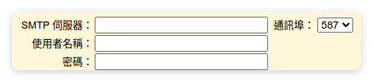
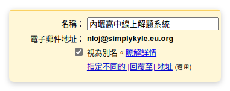

# 安裝
	- `cd ~/`
	- `git clone https://github.com/JustSimplyKyle/nloj`
	- `cd tioj`
	- `curl -sSL https://raw.githubusercontent.com/TIOJ-INFOR-Online-Judge/tioj/main/scripts/install.sh | DB_PASSWORD=nlhs bash -s`
- # 啟用
	- `sudo systemctl enable --now nginx`
	- `sudo systemctl enable --now tioj-judge`
- # 資料庫回復
	- ## 獲取新主機的 `key`
		- `cd ~/tioj`
		- `RAILS_ENV=production rails db`
		- `SELECT * FROM judge_servers;`
	- ## 贖回資料庫
		- `mysql -u root -p tioj_production < backup.sql`
	- ## 將 `key` 更新為在步驟一所得到的 `key`
- # 更新
	- 當你對任何 html 檔案，或是更改圖片時
	- 需執行 `update.sh` 將變更上傳到伺服器上面
- # 密碼重製設定
  collapsed:: true
	- https://tonypepe.com/posts/others/cf-email-routing-gmail
	- ## 修改 `config/settings.yml.example` 裡的 `smtp_settings`
		- 
		- `address`: SMTP 伺服器
		- `port`: 通訊埠
		- `user_name`: 使用者名稱
		- `password`: 密碼
		- `sender`
			- 
			- 這裡的電子郵件地址
	- ## 將檔案儲存為 `config/settings.yml`
	- ## 執行 `update.sh`
- # 網域