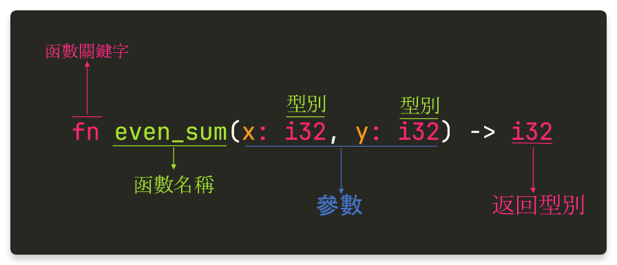

- {{renderer :tocgen2}}
- # 變數
	- 語法
		- `let 變數名稱 = 表達式;`
	- 在 Rust 中，所有變數都有 ((672f37e6-7911-4973-ab97-e6f5b6236896)) ，但是你可以不用特別把型別寫出來，編譯器會**自動**幫你推斷。
		- ```rust
		  let x = 42;	
		  ```
	- 也可以將型別手動標記出來。
	  ```rust
	  // i32 代表 32 位整數
	  let x: i32 = 42;
	  ```
	- 在 Rust，在預設情況話，所有變數都是 **不可變** 的，需利用 `let mut` 來宣告
	  ```rust
	  let x = 32;
	  x = 87; // 錯誤
	  let mut y = 32;
	  y = 72; // ok
	  ```
	- Rust 同時也支援 **Variables Shadowing**
	  ```rust
	  let x = 32;
	  let x = 64;
	  // x == 64
	  ```
- # 基礎型別
  id:: 672f37e6-7911-4973-ab97-e6f5b6236896
	- ## 數值
		- `i8` `i16` `i32` `i64`
			- 分別代表 `8`,`16`,`32` 及 `64` 位的**有**符號整數
		- `u8` `u16` `u32` `u64`
			- 分別代表 `8`,`16`,`32` 及 `64` 位的**無**符號整數
		- `f32` `f64`
			- 分別代表 `32` 及 `64` 位精度的浮點數
			- [[浮點數的陷阱]]
		- ### 運算
			- `+` `-` `*` `/` `%`
				- 分別代表 **加**、**減**、**乘**、**除** 及**取模** 等運算
			- 要注意的是，只有 **完全相同** 的類型才能運算，因此下列程式碼不會通過編譯
				- ```rust
				  let x: i32 = 20;
				  let y: i64 = 30;
				  let z = x + y; // ERROR
				  ```
	- ## `char`
		- **字元**
		- 以 `'a'` 所表達（不可用單引號）
		- 可儲存 unicode 之值 `'我'`
	- ## `bool`
		- **布林**
		- 為 `true` 或 `false`
- # 函數宣告
	- {:height 340, :width 774}
	- 簡單來說，與其他語言的差異：
		- 返回型別**後製**
		- 以 `fn` 表函數開頭
	- #+BEGIN_NOTE
	  由於 Rust 是 **強型別語言**，所有函數都需具有返回型別
	  #+END_NOTE
- # 表達式 vs 語句
	- ## 何謂表達式
		- 一種會 **返回** 值的操作：
			- `3+5`、`x+y`
			- 被 `{}` 包住的語句群中的最後一個表達式
	- ## 何謂語句
		- 當我們在加了一個 **分號**，任何的表達式都會變成語句。
		- ### 情況一
		  ```rust
		  fn main() {
		    	let y = 5;
		    	let x = {
		      	let z = y+3;
		        	z + 2
		    	};
		  }
		  ```
		- ### 情況二
		  ```rust
		  fn main() {
		    	let y = 5;
		    	let x = {
		      	let z = y+3;
		        	z + 2; 
		    	};
		  }
		  ```
			- 這時候 `x` != 8
			  x = `()`(稱為元組)
		- ### 元組類型
			- 此類型的唯一值即是 `()`
			- 可以想像她是個 **marker**，用來代表一個 「空」 的型別。
	- ## 再談函數
		- 了解何謂表達式後，你就知道函數的使用方法了。
			- ```rust
			  fn squared_add(x: i32, y: i32) -> i32 {
			    	let x_squared = x*x;
			    	let y_squared = y*y;
			    	x_squared + y_squared
			  }
			  ```
			- 由於 `x+squared + y_squared`
		- 所有函數都需具有返回型別，那請問 main 函數的返回型別為何？
		  ```rust
		  fn main() -> ???? {
		    
		  }
		  ```
		- 當我們發現一個函數沒有要傳回一個值的時候，我們用 `()`**元組**型別來代表
		  ```rust
		  fn main() -> () {
		    	
		  }
		  ```
		- 而當我們省略返回型別時，**元組**型別即為預設型別。
- # 流程控制
	- ## `if`
		- 本身即是 **表達式**：
		  ```rust
		  fn main() {
		    	let condition = true;
		      let number = if condition {
		        	5
		    	} else {
		        	6
		    	};
		  }
		  ```
		- 支援 `else if` 語法
		  ```rust
		  fn main() {
		      let n = 6;
		  
		      if n % 4 == 0 {
		          println!("divisible by 4");
		      } else if n % 3 == 0 {
		          println!("divisible by 3");
		      } else if n % 2 == 0 {
		          println!("divisible by 2");
		      } else {
		          println!("not divisible by 4, 3, or 2");
		      }
		  }
		  ```
	- ## `for`
		- 語法：
		  ```rust
		  for 元素 in 集合 {
		       
		  }
		  ```
		- 例子：
		  ```rust
		  fn main() {
		      for i in 1..=5 {
		          println!("{}", i);
		      }
		  }
		  ```
	- ## `while`
		- 語法：
		  ```rust
		  while 條件 {
		    	
		  }
		  ```
	- ## `loop`
		- 語法：
		  ```rust
		  loop {
		    
		  }
		  ```
		-
- # 所有權 & 借用
	- ## 先備知識
		- 在電腦中，所有的變數都需要 **記憶體** 來做儲存
		- 而在傳統程式語言(C) 底下，非常容易發生安全問題。
		- ```C
		  int* foo() {
		      int a;       
		      a = 100;
		      return &a;
		  }                   
		  ```
		- 而 Rust 的所有權系統，即是要解決 **記憶體安全性** 所研發的系統。
	- ## 所有權
		- ### 規則
			- Rust 每個值(**記憶體位置**)都被一個**變數**所擁有，稱之 **所有者**
			  logseq.order-list-type:: number
			- 一個值只能有**一個**所有者
			  logseq.order-list-type:: number
			- 將變數（所有者）離開作用域(大括弧所包住的程式區塊)，這個值將被丟棄(**drop**)
			  logseq.order-list-type:: number
		- ### 所有權轉移
			- #+BEGIN_TIP
			  先備知識：[[Stack and Heap]]
			  #+END_TIP
			- #### 對於在 **Stack** 上的數據，**不會**發生所有權轉移
				- ```rust
				  let x = 5;
				  let y = x;
				  ```
				- x 和 y 分別代表不同的記憶體位置，自然所有者也會不同
				- 但需要 **複製** 數據，所有只能對儲存在 **Stack** 上的數據這樣操作
			- #### 對於在 **Heap** 上的數據，**會**發生所有權轉移
				- #+BEGIN_TIP
				  String 介紹
				  與 C++ 的 string 類似，為可**動態**改變大小的字串。
				  #+END_TIP
				- ##### 變數綁定
				  ```rust
				  let s1 = String::from("hello");
				  let s2 = s1;
				  ```
					- `String::from("hello")` 的所有權將被轉移至 `s2`
					- 當試著存取 `s1` 時，將會 **報錯**（因 所有權在 `s2` 手上）
					- #+BEGIN_TIP
					  為何要這樣設計？
					  若 s1 與 s2 都能存取，在離開作用域的時候就會將同一塊記憶體 **二次釋放** (double free error)
					  #+END_TIP
					- 若你**執意**還要使用 `s1`(也就是說你要 s1 和 s2 皆指向 **不同** 的 Heap 區塊)
					  ```rust
					  let s1 = String::from("hello");
					  let s2 = s1.clone();
					  // s1 與 s2 皆能在此使用
					  ```
				- ##### 函數傳遞
				  ```rust
				  fn main() {
				    	let s = String::from("hello");
				    	print_str(s);
				    	// 這裡 `s` 已不可用! 因所有者已轉移至 `print_str` 底下。
				  }
				  
				  fn print_str(s: String) {
				    	println!("{}", s);
				  }
				  ```
	- ## 借用
		- 很多時候，當我們把變數傳遞到函式的時候，我們只需要知道他的值是什麼，不必做更改
		- 這時候，**借用**這個特性就起到了很好的作用。
		- 試想：當我們嘗試實現 `print_str` 的時候
		  ```rust
		  fn main() {
		    	let s = String::from("hello");
		    	print_str(s);
		    	// 這裡 `s` 已不可用! 因所有者已轉移至 `print_str` 底下。
		  }
		  
		  fn print_str(s: String) {
		    	println!("{}", s);
		  }
		  ```
		- 要如何讓 `s` 變得可用，利用 **不可變借用** 即可
		  ```rust
		  fn main() {
		    	let s = String::from("hello");
		    	print_str(&s);
		    	// 這裡 `s` 是可以用的! 因所有者仍是 `s`。
		    	// 因此，可以不限次數 call
		    	print_str(&s);
		    	print_str(&s);
		    	print_str(&s);
		  }
		  
		  fn print_str(s: &String) {
		      // s.push_str(" hello"); 此行刪除會得到 compile error
		    	println!("{}", s);
		  }
		  ```
		- **可變借用**：
		  ```rust
		  fn main() {
		    	let mut s = String::from("hello");
		    	print_str(&mut s); // s == hello hello 
		    	print_str(&mut s); // s == hello hello hello
		    	print_str(&mut s); // s == hello hello hello hello 
		    	print_str(&mut s); // s == hello hello hello hello hello
		  }
		  
		  fn print_str(s: &mut String) {
		    	s.push_str(" hello");
		    	println!("{}", s);
		  }
		  ```
		- #+BEGIN_IMPORTANT
		  一樣基於安全性的考量：**可變借用** 也和擁有權一樣，具有 **規則**
		  #+END_IMPORTANT
		- ### 懸垂引用
		  ```rust
		  fn main() {
		      let reference_to_nothing = dangle();
		  }
		  
		  fn dangle() -> &String {
		      let s = String::from("hello");
		  
		      &s
		  }
		  ```
		- ### 規則
		  1. 在 **同一時間下** ：不得有超過一個可變借用存在
		  2. 在 **同一時間下** ，存在可變借用：不得存在其他**不可變**借用
		  3. 引用必須是**有效的**
		- ### 違反借用規則
		  ```rust
		  fn main() {
		      let mut s = String::from("hello world");
		  
		      let word = &s
		  
		      s.clear();
		  
		      println!("borrowed word is: {}", word);
		  }
		  ```
		- 某些情況下利用 **所有權轉移** 來實行操作
		  ```rust
		  fn main() {
		      let s = String::from("hello");
		      let s = print_str(s);
		      assert!(s == "hello hello");
		      let s = print_str(s);
		      assert!(s == "hello hello hello");
		      let s = print_str(s);
		      assert!(s == "hello hello hello hello");
		      let s = print_str(s);
		      assert!(s == "hello hello hello hello hello");
		  }
		  
		  fn print_str(s: String) -> String {
		      s.push_str(" hello");
		      println!("{}", s);
		  }
		  
		  ```
- # String
	- 在 Rust 中，用 `""` 宣告的字串類別是 `&str` 而非 String
	- ```rust
	  fn main() {
	    	let my_name = "Kyle";
	    	greet(my_name);
	  }
	  
	  fn greet(name: String) {
	    	println!("Hello, {}!", name);
	  }
	  ```
	- ## 切片
		- 何謂切片？
		  **借用**在集合中**連續**的元素序列。
		- ```rust
		  fn main() {
		      let s: &str = "hello, world";
		    	// `&` 非常重要
		  }
		  ```
		- 可利用`[a..b]` 進行數據切片
		  ```rust
		  fn main() {
		    	let my_name = String::from("Kyle");
		    	greet(my_name);
		  }
		  
		  fn greet(name: String) -> &str {
		    	let first_two_letters = &name[0..=1];
		    	println!("Hello, {}!", first_two_letters);
		    	first_two_letters
		  }
		  ```
	- ## String 的方法
		- ```rust
		  fn main() {
		      let mut s = String::from("Kyle");
		      s.push_str(" hello, world");
		      s.push('!');
		  
		      assert_eq!(s, "Kyle, hello, world!");
		  }
		  ```
		  `String::from("Kyle")`：透過 `&str` 宣告 String
		  `s.push_str` ：向最後新增一個切片
		  `s.push()` ：向最後新增一個 `char`
		- `String::new()` 新增一個空的 `String`
		- ### .parse() 將 String 轉為數字
		  ```rust
		  fn main() {
		    	let string = String::new("237.3");
		      let value = string.parse::<f64>().expect("malformed input"); // 需要 `.expect()` 成功
		  }
		  ```
		- ### `format!` -- 與 `println!` 語法類似
		  ```rust
		  fn main() {
		    	let a = "hello";
		   	let b = "my name is";
		    	let c = "kyle";
		    	let ans = format!("{} {} {}!", a, b, c);
		  }
		  ```
- # 元組
	- 將多個不同類型**組合**成一個新的類型
	- ## 語法`(type1, type2, type3)`
	  ```rust
	  fn main() {
	      let tuple: (i32, f64, u8) = (500, 6.4, 1);
	    	let (x,y,z) = tuple; // 解構
	    	let a = tuple.0; // 利用 `.` 來訪問元組
	    	let b = tuple.1;
	    	let c = tuple.2;
	  }
	  ```
	- ## 常用於**回傳值**
	  ```rust
	  fn main() {
	      let s1 = String::from("hello");
	  
	      let (s2, len) = calculate_length(s1);
	    
	    	// s2 的大小是 len
	  }
	  
	  fn calculate_length(s: String) -> (String, usize) {
	      let length = s.len(); // len() 返回字符串的长度
	  
	      (s, length)
	  }
	  ```
- # 結構體
	- 與 **元組** 類似，但可以對每個欄位命名：
	  ```rust
	  struct User {
	      active: bool,
	      username: String,
	      email: String,
	      sign_in_count: u64,
	  }
	  ```
	- 使用方法：
	  ```rust
	  let mut user = User {
	    email: String::from("someone@example.com"),
	    username: String::from("someusername123"),
	    active: true,
	    sign_in_count: 1,
	  };
	  
	  user.email = String::from("anotheremail@example.com");
	  ```
- # 枚舉
	- 通過列舉可能的成員，來將可能性以型別的方式顯現出來
	- ## 宣告
	  ```rust
	  enum PokerCard {
	    Clubs,
	    Spades,
	    Diamonds,
	    Hearts,
	  }
	  ```
	- ## 使用
	  ```rust
	  fn main() {
	      let heart = PokerCard::Hearts;
	      let diamond = PokerCard::Diamonds;
	  }
	  ```
	- ## 也可以含有數值
	  ```rust
	  enum PokerCard {
	      Clubs(u8),
	      Spades(u8),
	      Diamonds(u8),
	      Hearts(u8),
	  }
	  
	  fn main() {
	     let c1 = PokerCard::Spades(5);
	     let c2 = PokerCard::Diamonds(13);
	  }
	  ```
	- ## 甚至可以含有結構體
	  ```rust
	  enum Message {
	      Quit,
	      Move { x: i32, y: i32 }, // 結構體
	      Write(String),
	      ChangeColor(i32, i32, i32), 
	  }
	  
	  fn main() {
	      let m1 = Message::Quit;
	      let m2 = Message::Move{ x:1 ,y:1 };
	      let m3 = Message::ChangeColor(255,255,0);
	  }
	  
	  ```
	- ## `Option`
		- 在 Rust，沒有 `null` 的概念，但可用 `Option` 來表示 **空值**
		  ```rust
		  enum Option<T> { // T 代表任意數據類型
		      Some(T),
		      None,
		  }
		  ```
		- #+BEGIN_TIP
		  為何要如此？
		  因為 Option<T> 與 T 的類型不同，所以以下程式碼編譯不會通過
		  #+END_TIP
		  ```rust
		  let x: i8 = 5;
		  let y: Option<i8> = Some(5);
		  
		  let sum = x + y;
		  ```
		- 那要如何使用呢？
		  在 ((67336fdf-8b40-4cdb-9338-bae17b0b63f3)) 會做介紹
- # 模式配對
  id:: 67336fdf-8b40-4cdb-9338-bae17b0b63f3
	-
	- ## 語法
	  ```rust
	  match target {
	      模式1 => 表達式1,
	      模式2 => {
	          語句1;
	          語句2;
	          表達式2
	      },
	      _ => 表達式3
	  }
	  ```
	  `match` 的結果本身也是一種表達式
	- ## 用法（一）
	  ```rust
	  enum Coin {
	      Penny,
	      Nickel,
	      Dime,
	      Quarter,
	  }
	  
	  fn value(coin: Coin) -> u8 {
	      match coin {
	          Coin::Penny =>  {
	              println!("You got a penny!");
	              1
	          },
	          Coin::Nickel => 5,
	          Coin::Dime => 10,
	          Coin::Quarter => 25,
	      }
	  }
	  ```
	- ## 用法（二）
	   ```rust
	  enum Message {
	      Quit,
	      Move { x: i32, y: i32 }, // 結構體
	      Write(String),
	      ChangeColor(i32, i32, i32),
	  }
	  
	  fn print_message(msg: Message) {
	      match msg {
	          Message::Quit => {
	              println!("Game ended!");
	          }
	          Message::Move { x, y } => {
	              println!("Moved from {} to {}", x, y);
	          }
	          Message::Write(string) => {
	              println!("{} recieved!", string);
	          }
	          Message::ChangeColor(r, g, b) => {
	              println!("Color has been changed into r:{}, g:{}, b:{}", r, g, b);
	          }
	      }
	  }
	  ```
	- ## 用法（三）
	  ```rust
	  enum Direction {
	      East,
	      West,
	      North,
	      South,
	  }
	  
	  fn main() {
	      let dire = Direction::South;
	      match dire {
	          Direction::East => println!("East"),
	          Direction::North | Direction::South => {
	              println!("South or North");
	          },
	      };
	  }
	  
	  ```
	- #+BEGIN_IMPORTANT
	  在模式配對中，必須列出**所有**的可能性!
	  #+END_IMPORTANT
	- ## Option 使用
		- ### match
		  ```rust
		  fn add_maybe_number(x: i32, y: Option<i32>) -> Option<i32> {
		      match y {
		          Some(y) => Some(x + y),
		          None => None,
		      }
		  }
		  ```
		- ### if let
			- 當你只要處理**一個條件**的時候，可以用 `if let`
			  ```rust
			  fn print_maybe(x: Option<i32>) {
			    	if let Some(x) = x {
			        	println!("{}", x);
			    }
			  }
			  ```
		-
- # Vector
	- 在 Rust 中，類型名為 `Vec<T>`，代表整個數組只能儲存同一種型別
	- ## 宣告及使用
	  ```rust
	  let v = vec![1,2,3];
	  let first_element = v[0];
	  
	  match v.get(2) {
	    	Some(third) => println!("Third element exists! {}", x),
	    	None => println!("Damn nothing exists.")
	  }
	  ```
	- ## 遍歷元素
	  ```rust
	  let v = vec![1, 2, 3];
	  for i in &v {
	      println!("{i}");
	  }
	  ```
- # Panic
	- 當發生了 **不可恢復的** 情形時，可利用 `panic!()` 來結束程式
	  ```rust
	  fn add_maybe_number(x: i32, y: Option<i32>) -> i32 {
	      match y {
	          Some(y) => Some(x + y),
	          None => panic!("You must provide a y value"),
	      }
	  }
	  ```
	- 對於 Option，可利用 `.expect()` 來達成一樣的效果
	  ```rust
	  fn add_maybe_number(x: i32, y: Option<i32>) -> i32 {
	    	x + y.expect("You must provied a y value")
	  }
	  ```
- # 測試
	- 可利用 [Compiler Explorer (godbolt.org)](https://godbolt.org/z/EeaYf5fns) 或是 [Rust Playground](https://play.rust-lang.org/?version=stable&mode=debug&edition=2021) 進行撰寫
	- ## 華氏攝氏轉換器
		- `input` 是使用者所輸入的第一行 `String`
		- 輸入格式如下 `243 C F` 代表 `從 243 攝氏到華氏
		- ```rust
		  fn main() {
		      let input = std::io::stdin()
		          .lines()
		          .map_while(Result::ok)
		          .next()
		          .expect("not valid input string");
		  }
		  ```
		- ### 推薦使用的函式
			- 將 input 用空格分開，並存到 `Vec` 裡面
				- `let values: Vec<&str> = input.split(' ').collect()`
		- ### 解答
		  collapsed:: true
			- ```rust
			  pub enum TempatureUnit {
			      Celcius,
			      Farenhite,
			  }
			  
			  pub struct Tempature {
			      pub value: f64,
			      pub unit: TempatureUnit,
			  }
			  
			  fn main() {
			      let input = std::io::stdin()
			          .lines()
			          .map_while(Result::ok)
			          .next()
			          .expect("not valid input string");
			      let (current, target) = parse_input(&input).expect("haha");
			      let Tempature { value, unit } = apply(current, target);
			      println!(
			          "{} {}",
			          value,
			          match unit {
			              TempatureUnit::Celcius => 'C',
			              TempatureUnit::Farenhite => 'F',
			          }
			      );
			  }
			  
			  fn apply(tempature: Tempature, target: TempatureUnit) -> Tempature {
			      let original_unit = &tempature.unit;
			      match (original_unit, target) {
			          (TempatureUnit::Celcius, TempatureUnit::Celcius) => tempature,
			          (TempatureUnit::Farenhite, TempatureUnit::Farenhite) => tempature,
			          (TempatureUnit::Celcius, TempatureUnit::Farenhite) => {
			              celsuius_to_farenhite(tempature.value)
			          }
			          (TempatureUnit::Farenhite, TempatureUnit::Celcius) => farenhite_to_celsius(tempature.value),
			      }
			  }
			  
			  fn celsuius_to_farenhite(degree: f64) -> Tempature {
			      Tempature {
			          value: degree * 32.0,
			          unit: TempatureUnit::Farenhite,
			      }
			  }
			  fn farenhite_to_celsius(degree: f64) -> Tempature {
			      Tempature {
			          value: degree / 32.0,
			          unit: TempatureUnit::Celcius,
			      }
			  }
			  
			  fn parse_input(input: &str) -> Option<(Tempature, TempatureUnit)> {
			      let mut words = input.split(' ');
			      let value = words.next()?.parse::<f64>().expect("malformed input");
			      let unit = match words.next()? {
			          "C" => TempatureUnit::Celcius,
			          "F" => TempatureUnit::Farenhite,
			          _ => panic!("Unsupported unit"),
			      };
			      let tempature = Tempature { value, unit };
			      let target = match words.next()? {
			          "C" => TempatureUnit::Celcius,
			          "F" => TempatureUnit::Farenhite,
			          _ => panic!("Unsupported unit"),
			      };
			      Some((tempature, target))
			  }
			  
			  ```