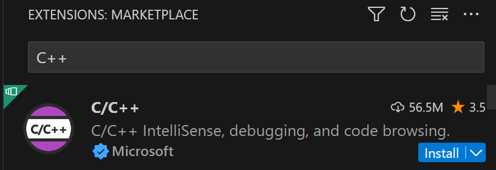
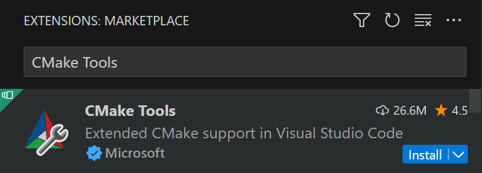

# 俄羅斯方塊術語與規則介紹
collapsed:: true
	- ## ARR
		- ### 定義
			- **A**uto **R**peat **R**ate - 自動重複速率
			- 在 DAS 延遲結束後，方塊**連續移動**的間隔時間
		- ### 為何需要
			- 允許玩家通過持續按住按鍵來快速移動方塊
	- ## DAS
		- ### 定義
			- **D**elayed **A**uto **S**hift - 自動移動延遲
			- 為在按下移動件後，距離方塊開始移動的時間間隔
		- ### 為何需要
			- 使玩家能夠更加輕易的做出一格移動
	- 其實，你在電腦上按下任何一個按鍵，都可以發現 DAS 間隔與 ARR 速率的存在
- # 難點攻關
	- ## 1. 旋轉如何實施？
	- 直接把旋轉完的方塊 array 寫在程式碼中
	- 根據每個不同的方塊，撰寫獨立的旋轉軸(pivot)
- # 安裝 Raylib
	- ## Raylib 簡介
		- 一個非常簡單的 C++ 2d 遊戲函式庫
	- ## 安裝教學
		- 我們將利用 [[vcpkg]] 來安裝函式庫，並利用 CMake 來在我們的 C++ 專案中使用
		- ### 1. 安裝 vcpkg
			- 開啟命令列（Win + R, 打 cmd）
			- ```bash
			  git clone https://github.com/microsoft/vcpkg.
			  cd vcpkg && bootstrap-vcpkg.bat
			  ```
		- ### 2.安裝 Visual Studio Code 延伸模組
			- 在 **擴充功能** 介面，安裝這兩個延伸模組
			- 
			- 
		- ###  3. 使用 vcpkg
			- 先設定 `VCPKG_ROOT` 環境變數
			  logseq.order-list-type:: number
				- logseq.order-list-type:: number
	-
- # C++ 語法補充
  collapsed:: true
	- ## lambda
	- ## [[指標與參考]]
	- ## std::optional
		- ### 定義
			- 一個**指標，**代表所其指到一個值可能是**存在或不存在**的。
			- 在**標頭擋**裡 `optional`
		- ### 用法
			- 若為無，將其值設為 `std::nullopt`
			- 以 `.has_value()` 確認其值是否存在
			- 以 `.value()` 得到其值
			- ```cpp
			  #include <optional>
			  #include <iostream>
			  
			  // 以 `std::optional<type>` 來代表
			  std::optional<int> fetch_bank_account(std::string name) {
			      if (name == "kyle") {
			          return 334;
			      }
			      if (name == "kevin") {
			          return 221;
			      }
			      if (name == "amy") {
			          return 209;
			      }
			      return std::nullopt;
			  }
			  
			  int main() {
			    	std::optional<int> kyle_account = fetch_bank_account("kyle");
			    	
			    	// 第一種存取方法，不倚賴自動型別轉換
			    	if (kyle_account.has_value()) {
			        	std::cout << kyle_account.value();
			      } else {
			        	std::cout << "You don't have a bank account!";
			      }
			    
			    	std::optional<int> dave_account = fetch_bank_account("dave");
			    
			    	// 第二種，較方便使用，要注意，拿回來的是指標，而非實際的值
			    	if (auto val = dave_account) {
			        	std::cout << *val;
			      } else {
			        	std::cout << "You don't have a bank account!";
			      }
			  }
			  ```
	- ## std::span
		- ### 定義
			- **只讀**的連續的一塊記憶體。
			- 不會重新**複製**資料，可以想成是對原本的資料的**參考**而已。
			- 在**標頭擋**裡 `span` ，需要 **C++ 20** 標準
		- ### 優勢
			- 能使使用者傳入**各式資料型態**。
			- 對於創造 subspan 而言極為輕鬆且**有效率**，不必宣告多餘的空間（與 `std::vector<int> subvec(vec.begin() + 2, 5)`相異）
			- 不必利用指標（亦或者迭代器）達成。
		- ### 用法
			- ```cpp
			  #include <span>
			  #include <iostream>
			  
			  void printSpan(std::span<int> span) {
			      for (const auto& elem : span) {
			          std::cout << elem << " ";
			      }
			      std::cout << "\n";
			  }
			  int main() {
			      std::vector<int> vec = {1, 2, 3, 4, 5, 6, 7, 8, 9, 10};
			      std::cout << "Vector span: ";
			      printSpan(vec);
			     
			    	// 創建一個自 vec 的 subspan (索引 2, 長度 5), 不會重新複製陣列
			      std::span<int> subSpan(vec.begin() + 2, 5); // {3, 4, 5, 6, 7}
			      std::cout << "Sub span: ";
			      printSpan(subSpan);
			  
			      // Create a std::array
			      std::array<int, 5> stdArray = {11, 12, 13, 14, 15};
			      std::cout << "std::array span: ";
			      printSpan(stdArray);
			  }
			  ```
	- ## [[結構體(struct)]]
	  id:: 66a7a403-20df-4ce1-86a6-75cef5c3640e
		- ### tl;dr
			- **結構體**：是一種自定義的數據類型，用於儲存和操作相關的數據。
			- **宣告及使用**
				- 通過**建構子**初始化，並使用成員方法來操作數據。
				- 利用**aggregate initialization**來快速初始化結構。
			- **`this` 指標**：用於指向當前對象，解決方法名稱衝突，並在內部方法中訪問成員數據。
	- ## 枚舉（enum、std::variant）
		- ### enum
			- 以型別安全的方式，告訴你有哪些種類。
			- ```cpp
			  enum Tetrominos { T, I, J, L, Z, S, O };
			  
			  std::string get_str() {
			    	// 利用 `::` 來存取欄位(field)
			    	auto block = Tetrominos::T;
			      switch (block) {
			          // 可利用 using 來縮短名稱
			          using B = Tetrominos;
			          case B::T: return "T Block!";
			          case B::I: return "I Block!";
			          case B::J: return "J Block!";
			          case B::L: return "L Block!";
			          case B::Z: return "Z Block!";
			          case B::S: return "S Block!";
			          case B::O: return "B Block!";
			      }
			  }
			  ```
		- ### std::variant
			- 定義：可以擁有含有各類型別的型別，可以想為型別安全版的 union。
				- `std::variant<int, double, string>`
			- ```cpp
			  #include <variant>
			  
			  // Utility to allow overloading lambdas for use in std::visit
			  // 請忽略這段 template 程式碼
			  template<class... Ts>
			  struct match : Ts... {
			      using Ts::operator()...;
			  };
			  template<class... Ts>
			  match(Ts...) -> match<Ts...>;
			  
			  
			  enum Tetrominos { T, I, J, L, Z, S, O };
			  
			  struct Color {
			      float r, g, b, a;
			  };
			  
			  
			  Color get_color(std::variant<Tetrominos, Color> data) {
			      auto visitor = match {
			          // a lambada that has a reference to the type of the variant
			          [](const Tetrominos& block) -> Color {
			            switch (block) {
			                using B = Tetrominos;
			                case B::T: return {0.78, 0.48, 1.00, 1.00};
			                case B::I: return {0.40, 0.75, 1.00, 1.00};
			                case B::J: return {1.00, 0.63, 0.00, 1.00};
			                case B::L: return {0.00, 0.47, 0.95, 1.00};
			                case B::Z: return {0.00, 0.89, 0.19, 1.00};
			                case B::S: return {0.90, 0.16, 0.22, 1.00};
			                case B::O: return {0.99, 0.98, 0.00, 1.00};
			            }
			          },
			          [](const Color& color) -> Color {
			            return color;
			          }
			      };
			      return std::visit(visitor, data);
			  }
			  ```