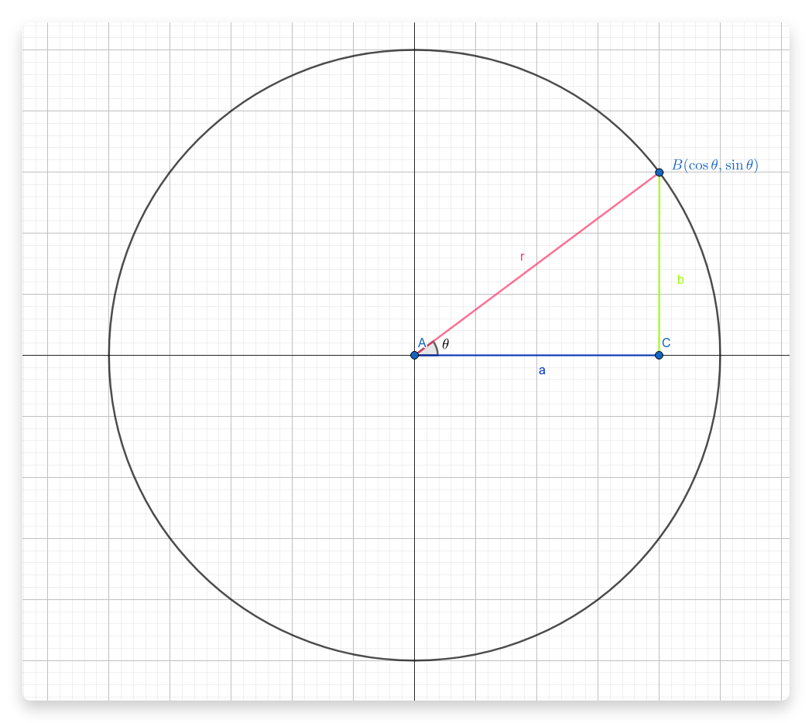

- 和角公式
	- $$ \sin(\alpha + \beta) = \sin{\alpha} \cdot \cos{\beta} + \cos{\alpha} \cdot \sin{\beta} $$
	- mnemonics
		- 撒口尬口撒
	- 衍生（2 倍角公式）
		- #+BEGIN_EXPORT latex
		  \begin{align*}
		  \sin(2\theta) &= \sin(\theta + \theta) \\
		  \sin(\theta + \theta) &= \sin{\theta} \cdot \cos{\theta} + \cos{\theta}\cdot \sin{\theta}   \\
		  \sin(\theta + \theta) &= 2(\sin{\theta} \cdot \cos{\theta}) \\
		  \end{align*}
		  #+END_EXPORT
- 奇變偶不變，正負看象限
	- #+BEGIN_EXPORT latex
	  \begin{align*}
	  &\sin(90*1 + 50) = &\cos(50) \\
	  &\sin(90*2 + 20) = &-\sin(20) \\
	  &\sin(90*3 + 30) = &-\cos(30) \\
	  &cos \rightarrow x 座標 \\
	  &sin \rightarrow y 座標 \\
	  &正負轉換看左式
	  \end{align*}
	  #+END_EXPORT
- 餘弦定理
	- $$ c^2 = a^2 + b^2 -2ab \cdot \cos{\theta} $$
- 基礎定義
	- #+BEGIN_EXPORT latex
	  \begin{align*}
	  &\boxed{sin = \frac{對邊}{斜邊}} \\
	  &\boxed{cos = \frac{鄰邊}{斜邊}}\\
	  &\boxed{tan = \frac{對邊}{鄰邊}}
	  \end{align*}
	  #+END_EXPORT
- 單位圓意義
	- 
	- 單位圓 -> r = 1
		- if r = 1, then $$ \sin{\theta} $$ would be the y coordinate
			- #+BEGIN_EXPORT latex
			  \begin{align*}
			  \sin{\theta} &= \frac{b}{r} \\
			  \sin{\theta} * r &= b \\
			  \sin{\theta} * 1 &= b
			  \end{align*}
			  #+END_EXPORT
		- same principle for the x coordinate
			- #+BEGIN_EXPORT latex
			  \begin{align*}
			  \cos{\theta} &= \frac{a}{r} \\
			  \cos{\theta} * r &= a \\
			  \cos{\theta} * 1 &= a
			  \end{align*}
			  #+END_EXPORT