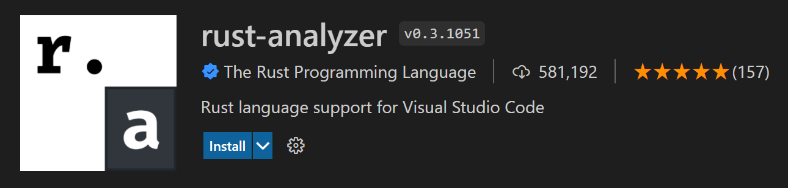

# 如何使用 packages 
利用 `cargo new <your_package_name>` 創建一個專案
在專案目錄內，利用 `cargo add <package_name>` e.g. `cargo add anyhow`
在 `src/main.rs` 內
```rust
fn main() -> anyhow::Result<()>{
    something_that_returns_err()?;
    something_returning_different_err()?
   Ok(())
}
```
由上述可知，要利用其它套件時，利用 `package::item` 來存取。
- 另一個好用套件包是 `reqwest`
  e.g. `cargo add reqewst`
  功能：各種網路相關的方法。
  https://docs.rs/reqwest/latest/reqwest/
- # 讓其他包存取你的函數、結構體
- ## `pub` 關鍵字
  預設上，在 rust 只有 **同一** 檔案中宣導的結構體、函數… 才可以存取
  要存取其他檔案的結構體，必須做以下幾點：
  1. 在結構體… 等，宣告是前面加一個 `pub`
  `user.rs`
  ```rust
  pub struct User;
  pub fn create_user() -> User {}
  struct Private;`
  ```
  2. 在另一個檔案：
  ```rust
  mod user // 因為叫做 user.rs，所以先宣告這個包
  use user::User // 將 User "include" 進來
  
  fn main() {
     let user = User {};
     create_user() // 但若沒利用 `use` 則編譯不會過
     user::create_user() // 或是利用`module::item` 
     let p = user::Private {}; // 但若在 `user.rs` 中未宣導成 `pub` 則編譯仍然不會過。
  }
  ```
- # 有用的工具
	- ## 接受命令列參數
	  利用此函數：`std::env::args()`（https://doc.rust-lang.org/beta/std/env/fn.args.html#examples）
	- ## 接受使用者輸入
	  利用此函數：`std::io::stdin()` 獲取一個能操縱 `input` 的結構體
	- ## 讀取檔案
	  `std::fs::read_to_string(file_path)`
- # 範例作業
	- #+BEGIN_TIP
	  建議利用 vscode 撰寫。
	   
	  #+END_TIP
	- [[安裝 Rust]]
	- `greetings`
		- 目標
			- 程式接受一個命令列參數，獲取年齡，再利用使用者輸入，獲取使用者姓名。
		- 範例輸入輸出
			- 例：`./greetings --age 3` // 輸入 kyle
			  輸出：`kyle, age: 3`
	- `read_file`
		- 目標
			- 從命令列參數中，讀取參數中所指的檔案
			- 輸出第三行的所有字母，如果沒有第三行，則輸出「"Too short of a file"」
	- ((6752861c-e48d-48aa-8d65-7f189ff95b08))
	-