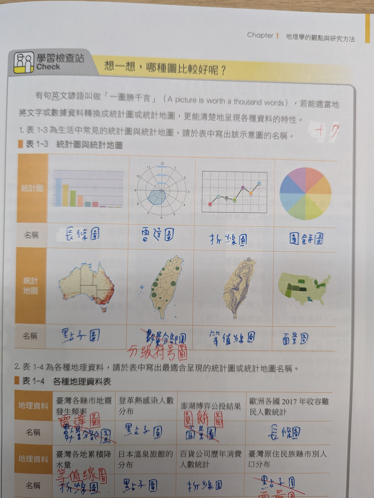
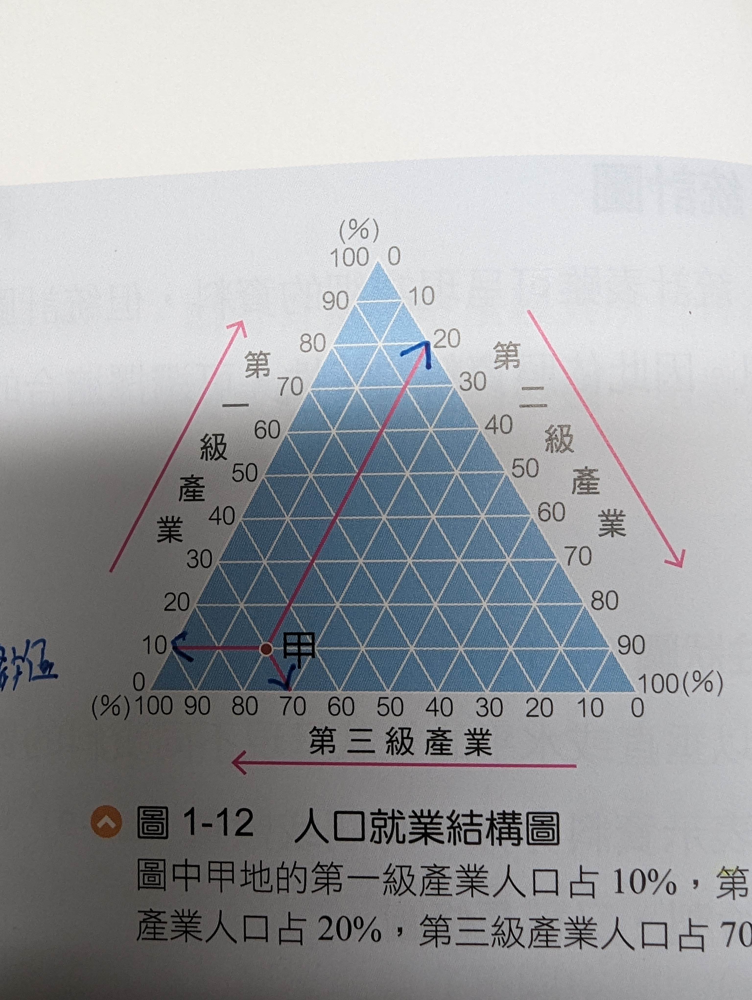

deck:: 地理::一上

- # 地理學的傳統與觀點
	- 三種地理學分析（傳統） :-> 空間、生態（人文）、區域
	  id:: 64f46b1a-679a-4636-b116-b9c48568d3dc
	- ## 空間傳統
		- 研究 {{c1 **空間**}} 分佈於其 {{c2 **交互**::兩地之間往來}} 作用
		  id:: 64f46b59-82c4-4343-a44d-b4d76cf40797
		- 空間擴散、強調 {{c2 **範圍**}}
		  id:: 64f46b69-625a-4975-96ac-1f7ff64f5b3f
	- ## 生態（人文）傳統（分析）
		- 研究 {{c1 **自然**}} 與 {{c1 **人類**}} 的 **互動** 關係
		  id:: 64f46bfa-8957-4030-9468-799a78c0ba2a
			- 強調 **因果** 關系
	- ## 區域分析
		- 基於 {{c1 **空間**}} 與 {{c1 **人文**}} 來實現區域計畫
		  id:: 64f46ce8-8a2b-4637-b026-1c1228c88611
		- 明確區域
		- 綜合各項因果來做評估，分析
	- ## 各項例子比較
		- ### 核電廠對於環境的影響 #card
		  id:: 64f46dba-c0ff-4112-af2b-5315d43810b8
			- 生態傳統
				- 核電廠 -> 人類
				- **環境** -> 自然
				- **影響** -> 互動關係
		- ### 是否要在深奧蓋核電廠 #card
		  id:: 64f46e43-a169-4a73-a621-0e4bc57f721d
			- 區域分析
				- 深奧 -> **明確** 區域
				- 核電廠 -> 人文
				- 是否要在 -> 評估、分析
- # 資料展示
	- 統計地圖判別
	  collapsed:: true
		- {:height 544, :width 600}
		  id:: 6505981b-b194-4e28-9334-ca37b7819c60
		  occlusion:: eyIuLi9hc3NldHMvaW1hZ2VfMTY5NDg2NTQzNTc1MV8wLnBuZyI6W3sibGVmdCI6Njc4LjczNDM2MzQxMjY2MzYsInRvcCI6MjczOC45MDg4MDczMjg1NTIsIndpZHRoIjo0MzcuNDA0NzYwMzc5MTQ4NywiaGVpZ2h0IjoyMDAuMDAwNjg4MTQzODM1MDUsImFuZ2xlIjowLCJjSWQiOjF9LHsibGVmdCI6MTI5NC45MTc3Mjk1MDQwODksInRvcCI6Mjc4NS4wOTQwNzA3ODgxNTk2LCJ3aWR0aCI6NTU0LjE3NDQ4MTE3MjkxMjUsImhlaWdodCI6MjY5LjAwNTA0NTc5OTcxMTc1LCJhbmdsZSI6MCwiY0lkIjoyfSx7ImxlZnQiOjE5MDguNTE1Mjc4MzM0NTA4LCJ0b3AiOjI3NzMuNTkzOTQxNzYxMTkwOCwid2lkdGgiOjQ0Ni4yNjI5NTkzMTQ4OTU4NSwiaGVpZ2h0IjoyMzYuMDA0NzUzMzM4NTgxODUsImFuZ2xlIjowLCJjSWQiOjN9LHsibGVmdCI6MjQ4MS4yOTQwNTY2NTM4NjY0LCJ0b3AiOjI3ODUuNTk4MTIyMjM0OTg5Nywid2lkdGgiOjUxOS45MjUwMTIwMzI4MjUyLCJoZWlnaHQiOjI5MC4wMTMyMTc1MDc3NTU2LCJhbmdsZSI6MCwiY0lkIjo0fSx7ImxlZnQiOjEzMTguMTY0NDUxMjExMzA0NiwidG9wIjoxOTI4LjI0MzAyMDQxODg3MjcsIndpZHRoIjo0NTcuMzM5NTcyMjcyMTk4OSwiaGVpZ2h0IjoyNTAuNzExMDAwMTQzNzYxMzQsImFuZ2xlIjowLCJjSWQiOjV9XX0=
	- ## 三角形圖
		- 使用時機
			- 三項總和為 100%
		- 如何讀取 #card
		  id:: 65059b63-1dd4-4964-8942-d2f709e2822e
			- 平行線 + 箭頭
			- 箭頭指向之數值
		- 例子
		- {:height 568, :width 525}
			- 第一集產業 :-> 10%
			  id:: 65059b34-4485-44a6-96fc-7d23cb8ee472