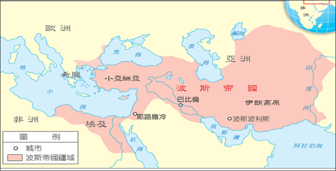
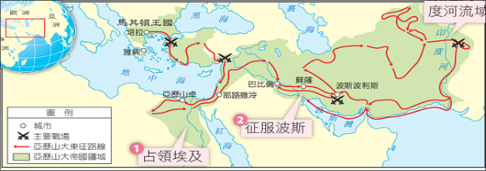
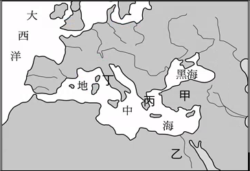

public:: true

- {{embed [[四大古文明、希臘與羅馬文化]]}}
- # 知識點
	- #+BEGIN_IMPORTANT
	  屋大維 - 結束共和，開始羅馬共和
	  君士坦丁 - 開創拜占庭帝國
	  查士丁尼 - 最偉大拜占庭帝國皇帝
	  #+END_IMPORTANT
	- #+BEGIN_WARNING
	  周而復始的生命觀為**尼羅河***周而復始* 的氾濫
	  #+END_WARNING
	- #+BEGIN_TIP
	  知識點：波斯帝國與亞歷山大帝國疆域最主要差異點在於是否有統治希臘
	  波斯
	  
	  
	  #+END_TIP
	- #+BEGIN_CAUTION
	  法老同為埃及的統治者，也是太陽神化身
	  漢摩拉比法典為太陽神**授權**給王權，王權名義上不為太陽神
	  #+END_CAUTION
	- #+BEGIN_TIP
	  羅馬位於意大利（丁）
	  
	  #+END_TIP