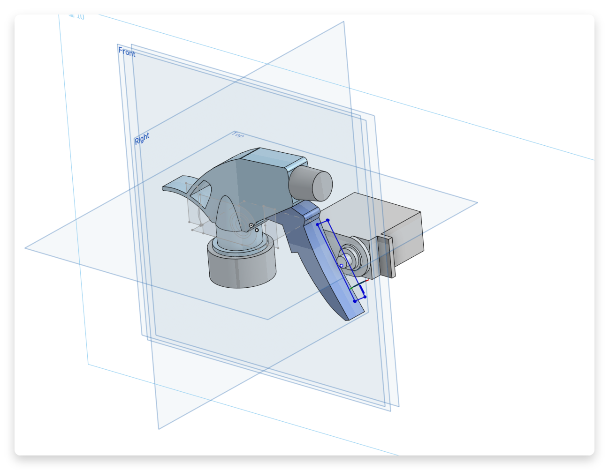

# 設計理念
	- 以馬達旋轉之扭力，直接轉動噴頭懸臂。
	- 以雷切機做出外殼，並以紅外線感測器作為偵測。
- # 實現步驟
	- 先無視外殼，先撰寫馬達和紅外線感測器的操縱程式和走線安排好。
	- 學習 3D 建模技術(onshape)
		- 利用馬達懸力直接轉動噴瓶
		  
		- 蓋上木板
		  
	- 雷切出 3D 建模的物件
- # 問題
	- ## 木板公差以致馬達無法順利卡進木板
		- 利用 **銼刀**，將開口摩大直至大小足夠。
	- ## 馬達與噴頭懸臂距離過遠
		- 利用 **紙板** 墊高馬達與木板間的空隙。
	- ## 忘記建模 Type-C 孔，但木板已無法送進雷切機
		- 先利用 **美工刀和銼刀**，刮出一塊小洞，再利用 **焊槍** 將其燒穿。
- # 成品顯現
	- 噴瓶