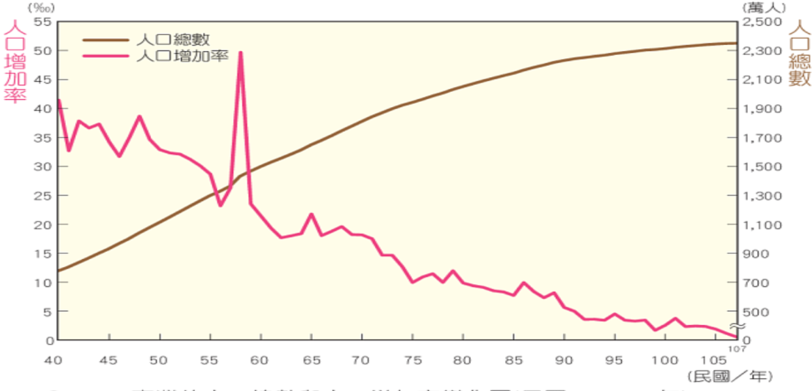

deck:: 社會一下::第一課-臺灣的人口如何變動
title:: 第一課-臺灣的人口如何變動

- # 人口成長的要素
  collapsed:: true
	- 一地的人口數量為一動態的變化過程
	- 人口成長
		- 人口數量的變動
		- 自然增加+社會增加 && 人口總數
		- 
		- ## 影響因素
			- 自然增加
				- 因出生與死亡所造成
				- 出生多 -> 正
				- 死亡多 -> 負
			- 社會增加
				- 因移入與移出所造成
				- 移入多 -> 正
				- 移出多 -> 負
- # 臺灣人口成長的歷程
	-