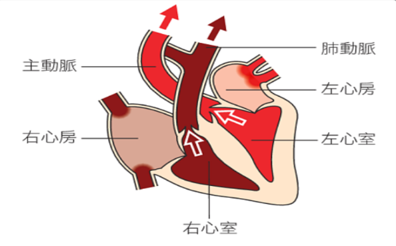
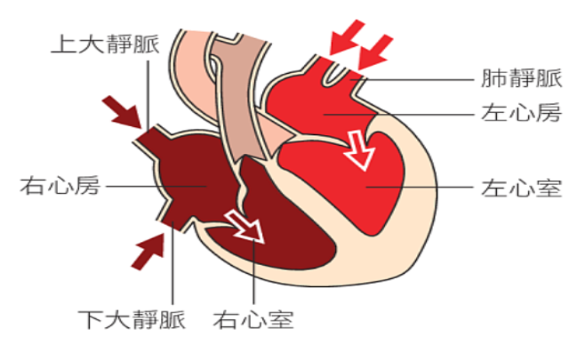

deck:: 自然一上::第三課-動物體內物質的運輸

- 動物體內物質的運輸，依賴循環系統
- # 循環系統的分類
	- ## 開放式循環
		- {{cloze 血液由血管內流入體腔，與組織細胞交換物質後，流回血管、心臟::定義}}
		  id:: 62d0f5dc-28e4-4908-b77d-f84e81272f6e
		- ### 例 #card
		  id:: 62d0f675-f7a5-4086-9705-a76d2c1719dc
			- 蝦
			- 蝸牛
			- 昆蟲
	- ## 閉鎖式循環
		- {{cloze 血液只在心臟和血管中流動，不可流到體腔::定義}}
		  id:: 62d0f6a4-015d-4cf0-9679-57b9f066f824
		- 藉微血管與 {{cloze 組織細胞}}交換物質
		  id:: 62d0f6be-d838-49ff-a5f2-db3f204e4847
		- ### 例 #card
		  id:: 62d0f6d3-d2ef-4a04-b22a-77b4fc3ab24f
			- 蚯蚓
			- 魚
			- 蛙
			- 人類
	- ## 人類循環系統分類
		- 血液循環系統 #card
		  id:: 62d0f776-4123-4888-a9f6-b90751a54e36
			- 心臟
			- 血管
			- 血液
		- 淋巴循環系統
- # 血液循環系統
	- ## 心臟
		- ### 位置 #card
		  id:: 62d0fa76-0401-4282-ac88-8f23ee8944f2
			- 位於胸中央偏左
			- 上方為左心房和右心房
				- 實際位置左右相反
			- 下方為左心室和右心室
				- 實際位置左右相反
			- 心室 > 心房
		- ### 心搏
			- 心臟收縮與舒張
			- 為血液在血管中流動的主要動力來源
			- 收縮 -> {{cloze 因擠壓而流入動脈}}
			  id:: 62d0fae8-8cfc-4ede-8db0-1ef82bb932c4
				- {:height 215, :width 345}
			- 舒張 ->  {{cloze 靜脈的血液流回心臟}}
			  id:: 62d0fb00-9054-43a4-86bc-7bfd3fb6725a
				- {:height 218, :width 339}
	- ## 血管
		- ### 動脈 #card
		  id:: 62d10096-fc5a-4398-996d-4e60c5bf5368
			- 將血液自心臟送到身體各組織
			- 管壁厚，富彈性
		- ### 微血管 #card
		  id:: 62d1009c-3c55-41fa-a4f6-39f12182ef9f
			- 管壁只有一層細胞的厚度
				- 為讓血液和組織細胞間進行物質交換
		- ### 靜脈
			- 管壁比動脈薄，彈性較低
				- 但管腔則比動脈大
			- 有些靜脈具瓣膜
				- 為防止血液逆流
		- ### 比較
			- ||動脈|微血管|靜脈|
			  |管壁|最厚|最薄|次之|
			  |管腔|次之|最薄|最大|
			  |血壓|最高|最低|次之|
			  |流速|最快|最慢|次之|
	- ## 血液
		- ### 血漿 #card
		  id:: 62d10787-5c31-4856-a2c6-4d2737beeefe
			- 主要成分為水
			- 內也有養分、激素、代謝產生的廢物等物質
		- ### 血球
			- #### 紅血球 #card
			  id:: 62d107c6-1c20-4f29-8753-98730d944ab6
				- 不具細胞核
				- 呈雙凹圓盤
				- 數量最多
				- 主要功能為攜帶氧氣
					- 血紅素
			- #### 白血球 #card
			  id:: 62d107d7-4954-4989-9da7-3b455aaf6e19
				- 具有細胞核
				- 數量最少
				- 主要功能為如吞噬痛原體
					- 若有病原體侵，數目會急遽增加
			- ### 血小板 #card
			  id:: 62d107dc-68eb-496c-a536-889df6c159e2
				- 不具細胞核，形狀不規則
				- 體積最小
				- 主要功能為促使血液凝固
			- #### 比較
				- ||紅血球|白血球|血小板|
				  |數量|最多|最少|次之|
				  |細胞核|無|有|無|
				  |形狀|雙凹圓盤狀|圓球形|不規則|
				  |大小|次之|最大|最小|
				  |功能|攜帶氧氣|吞噬病原體|促使血液凝固|
- # 血液循環的途徑
	- ## 體循環 #card
	  id:: 62d22990-bcd2-453d-be6f-199332e6dfde
		- 左心室 -> 主動脈 -> 小動脈 -> 組織微血管 -> 小靜脈-> 上、下大靜脈 -> 右心房
		- 氧氣多（肺靜脈） -> 氧氣少
			- 組織吸收
	- ##  肺循環 #card
	  id:: 62d22c5c-aa5a-4d6a-9719-2bbf32c995a7
		- 右心室 -> 肺動脈 -> 肺部微血管 -> 肺靜脈 -> 左心房
		- 氧氣少 -> 氧氣多
			- 肺部交換
	- 左心房 -> 左心室 -> 組織 -> 右心房 -> 右心室 -> 肺動脈 -> 肺靜脈 -> 左心房
- # 淋巴循環系統
	- 包含 #card
	  id:: 62d22d88-18a9-4c0b-b931-aee4f591caf5
		- 淋巴、淋巴管和淋巴器官（淋巴結）
	- ## 淋巴 #card
	  id:: 62d22df4-79da-4060-afd0-9abed79ce087
		- #組織液 滲入淋巴管
		- 最後會回到靜脈
	- ## 淋巴結 #card
	  id:: 62d22e8e-1736-4cd0-8b8f-bfb8abcadf92
		- 淋巴流經淋巴結時，過濾異物和病原體