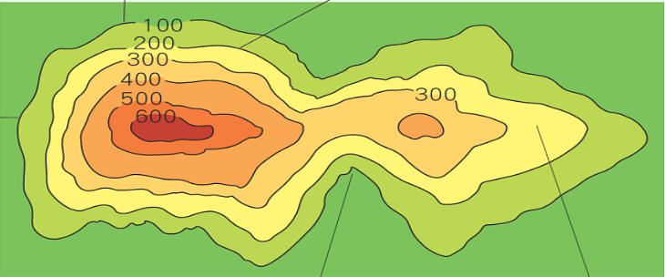

- # 不同種類地圖
  collapsed:: true
	- 等高線地形圖
	- 分層設色圖
	- 地形剖面圖
	- 立體地形圖
	- 衛星影像
- # 等高地形圖
  collapsed:: true
	- 定義：地表海拔高度相同的各點連接成的閉合曲線
	- ## 資訊
		- 地表形態
		- 海拔高度
		- 相對高度
			- 兩地點之高度差
		- 坡度
- # 分層設設色圖
	- 定義：將等高線地圖，不同區域畫成不同顏色
	- 
	- ## 特色
		- 等高線愈稀疏，坡度愈平緩
			-