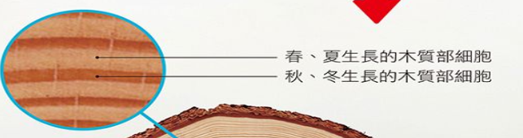

deck:: 自然一上::第三課-植物的運輸構造

- # 維管束與形成層
	- ## 維管束定義 #card
	  id:: 62ccef15-2de9-4d62-a94f-0e95ad058422
		- 負責運輸水分及養分的細胞，且排列成束
	- ## 維管束組成
	  collapsed:: true
		- 木質部 #card
		  id:: 62ccef85-438b-42ff-87d3-6c8992fb0c0b
			- 位於內側
			- 負責運輸水分和礦物質的構造
			- 也具有支持的功能
		- 韌皮部 #card
		  id:: 62ccefab-a772-49e8-93e6-4e74b037ad20
			- 分布於外側
			- 光合作用所製造的養分
		- 形成層
			- 
			- 位於 {{cloze 韌皮部與木質部::a與b}}之間
			  id:: 62ccf085-2f48-4d4d-b372-1019ae2b4675
			- 維管束需呈 {{cloze 環狀排列}}
			  id:: 62cceffd-1335-496b-89e1-1d472ef2dbfe
				- #### 例 #card
				  id:: 62ccf0d2-414b-4cfe-a7ab-8fe67d996830
					- 榕樹
					- 向日葵
				- #### 反例 #card
				  id:: 62ccf0ed-1953-4737-95a9-0c0c421c1475
					- 散生排列
					- 玉米
					- 水稻
			- 形細胞分裂，以增生 {{cloze 韌皮部及木質部::a及b }}細胞
			  id:: 62ccf0a1-9111-488e-aafd-5a4600aca7f0
- # 樹皮與年輪
	- ## 樹皮
		- 樹幹的保護層
		- 包鈳韌皮部及其外圍構造
	- ## 木材
		- 木質部堆積形成木材
	- ## 年輪形成原因
		- 
		- 在樹幹的橫切面，會形成深、淺對比明顯的環紋
			- 春、夏細胞生長速度較快，造成木材顏色比較淺
			- 秋、冬生長速度較慢，造成木材顏色較深
			-