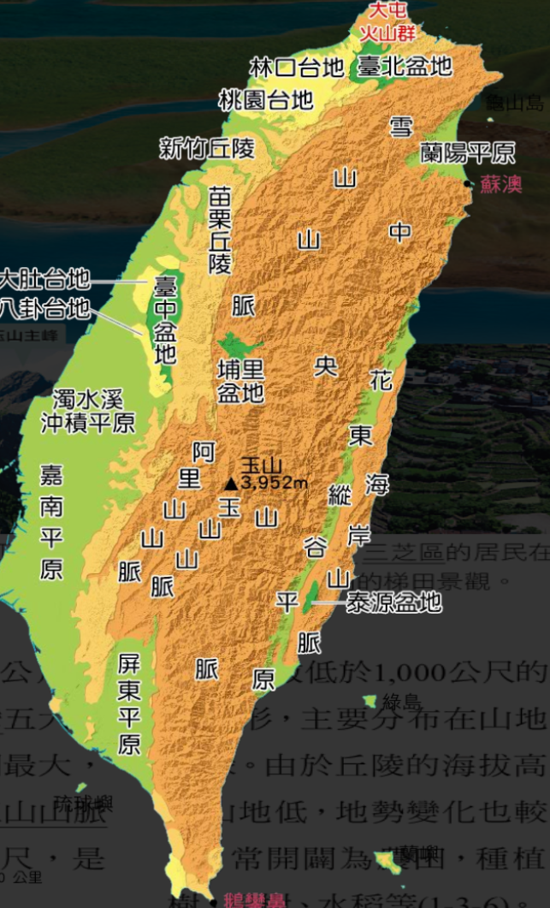

deck:: 社會一上::第三課-臺灣的地形

- # 土石流
  - 為常見環境災害
  - 導致損壤
  - 甚致失去性命
- # 臺灣的地形特微
  - 位於歐亞板塊與菲律賓板塊
    - 在因板塊的推擠，使原本在海底的沉積物降起
    - 呈現 {{cloze 南北向}}的 {{cloze 新振曲山脈}}
      id:: 62c243b7-5288-48b9-842f-63f22a352521
  - 至今仍有火山活動與地震
    - 因 {{cloze 內營力}}的影響
      id:: 62c24425-2df6-44f1-9235-edfea40793d9
      - {{embed [[內營力與外營力]]}}
  - ((62c244ec-4283-4dfe-b3ed-b4c8c4127a7a)) 與 ((62c244b5-17ae-411e-9761-d0641b85cfed)) 透過過侵蝕、搬運、堆積，塑造地表高低起伏形貌
  - ## 地形特色
    - 山地廣大
    - 地勢高聳
    - 坡面陡峭
    - 地質破碎
- # 臺灣的地形分布
  - {:height 623, :width 310}
  - ## 山地
    - 海拔 {{cloze 超過1000公尺}}
      id:: 62c2482a-a184-4ee9-8119-c96a40bef0e8
    - 中央山脈為臺灣的脊梁
    - 多分布於東部
    - ### 例
      - 雪山山脈 #card
        id:: 62c24a00-c339-4846-bb34-70f252043059
        - 中上
      - 中央山脈 #card
        id:: 62c24a14-a09b-4691-823d-da99690ea860
        - 最長的
      - 玉山山脈 #card
        id:: 62c24a1e-ab3a-4edb-83ec-91c4570b4fc5
        - 中中下
      - 阿里山山脈 #card
        id:: 62c24a32-fe20-43ce-b3f7-1e0a9f67714b
        - 玉山山脈左
      - 海岸山脈 #card
        id:: 62c24a53-bff0-4228-945b-33427642c0db
        - 中央山脈右
  - ## 丘陵
    - 海拔 {{cloze 低於1000公尺的起伏地形}}
      id:: 62c24c1e-b847-4850-9e8a-f3b8bfcf88c8
    - 分布在 {{cloze 山地外緣}}
      id:: 62c24c45-708f-476f-91aa-08daeff54c22
    - 常開闢為農田，種櫝茶樹，果樹，水稻
    - 多分布於西部
    - ### 例
      - 新竹丘陵 #card
        id:: 62c24ebf-fcb9-4995-b0da-d0fee89cd47a
        - 中上上
      - 苗栗丘陵 #card
        id:: 62c24eec-5f26-4f9b-bf91-ab1857ff81da
        - 中上
  - ## 平原
    - 海拔較低、地勢平坦
    - 主要的農業生產地帶
    - 以 {{cloze 嘉南平原}}面積最大
      id:: 62c24f5c-084b-47bb-97e9-7f41ec68e659
    - 多分布於西部
    - ### 例
      - 濁水溪沖積平原 #card
        id:: 62c24f71-6b73-433b-8ccd-9db1c18aa4a1
        - 中左
      - 嘉南平原 #card
        id:: 62c24f8a-803f-4b86-a699-9b2b19335071
        - 中在下
      - 屏東平原 #card
        id:: 62c24f9c-d5b5-4cad-9865-9a88b312f132
        - 下
      - 花東縱谷平原 #card
        id:: 62c24fcd-b481-4bea-8884-0e2d8f12ce84
        - 夾在中央山脈與海岸山脈之間
  - ## 盆地
    - 被丘陵、山地圍繞
    - 因地勢平坦，適合人類活動
    - 分布於山地、丘陵與台地之間
    - ### 例
      - 臺北盆地 #card
        id:: 62c2807a-90f8-4b87-bdc7-a4c2df7cceb0
        - 全臺人口密度最高
      - 埔里盆地 #card
        id:: 62c2809d-bebd-4712-9d16-061fcdb2dfe3
        - 正中央
      - 臺中盆地 #card
        id:: 62c280b0-af86-4980-a68a-8a4378009b8e
        - 中左
      - 泰源盆地 #card
        id:: 62c280c2-a993-45bd-8ba1-58d3d80a398f
        - 海岸山脈內，右下
          -
  - ## 台地
    - 海拔 {{cloze 低於1000公尺}}
      id:: 62c280f4-c584-41cd-a47c-594d2fbc8419
    - 高而平坦
    - 分布在盆地、平原或丘陵的接觸帶
    - 若改善 {{cloze 供水}}，可成為農業、工業用地
      id:: 62c28134-4666-4b83-a0ce-de3b4dd4a86b
    - 多分布於西部
    - ### 例
      - 林口台地 #card
        id:: 62c28166-ca1d-4b82-8ed7-e4355366a47d
        - 臺北左下
      - 桃園台地 #card
        id:: 62c2817a-bd42-4a31-8fee-bed194be7893
        - 林口左下
      - 大肚台地 #card
        id:: 62c2818e-e076-4a51-8477-0212cce45dbf
        - 臺中左上
      - 八卦台地 #card
        id:: 62c281a9-f58a-4a14-a74c-9130989abff8
        - 臺中左下