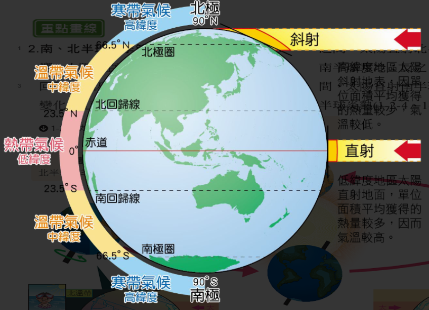

deck:: 社會一上::第二課-位置對臺灣的影響

- # 經度與時區
  collapsed:: true
	- ## 時區
		- 每15度一時區 #card
		  id:: 40caaf7f-75db-4ade-96f2-b0b098181427
			- 平均每小時地球自轉度數(360/24=15)
		- 國際標凖時間
			- 倫敦格林威治天文臺
			- 又稱
				- 格林威治時間
				- GMT
	- ## 時差
		- 每向東一時區，時間快一小時
			- 向西，慢一小時
		- 臺灣在 120 E 上，120/15=8，因此我們比國際標凖時間快8小時
		- 舊金山在 120 W 上，120/15=8，因此他們比國際標凖時間慢 8 小時
	-
- # 緯度與氣候
  collapsed:: true
	- ## 氣候差異形成原因
		- 太陽光照射角度不同
			- 鈄射
				- 獲得熱量較少
				- 高緯度地區
			- 直射
				- 獲得熱量較少
				- 低緯度地區
	- ## 氣候帶分類
		- ### 北回歸線到南回歸線  #card
		  id:: 62bfa58e-689a-468f-99a9-cae57c7871cf
			- 熱帶氣候
		- ### 回歸線到極圈 #card
		  id:: 62bfa5d8-e8d3-450c-a521-fbacb0caeeb9
			- 溫帶氣候
		- ### 極圈到極點 #card
		  id:: 62bfa616-ed55-46d5-8f5d-a0d78ae91622
			- 寒帶氣氣候
		- {:height 405, :width 616}
	- ## 南北半球季節差異
		- 季節相反
		- {{embed [[季節]]}}
		-
- # 臺灣生物的多樣性
  collapsed:: true
	- ## 大陸邊緣
		- 通時澭有海、陸兩域的生態環境與資源
	- ## 寒、暖洋流交會處
		- ### 洋流
			- 低緯往高緯流動的稱為 {{cloze 暖流}} #card
			  id:: 62c04b88-0479-475e-9b34-f086d877d765
				- 黑湖
			- 高緯往低緯流動的稱為 {{cloze 涼流}} #card
			  id:: 62c04bb9-80cf-4f3d-afde-d9fc383e4efd
				- 中國沿岸流
		- 黑潮與中國沿岸流的交會處
			- 帶來豐富的海洋生態資源
	- ## 溫、熱帶交界處
		- 物種在季節轉換時，南北遷徙路線
			- 黑面琵鷺
				- 10 月來臺過冬
				- 隔年3月北返
	- ## 板塊接觸帶 #card
	  id:: 62c04fca-fb9f-4155-8afc-670adb53c263
		- 造成多高山且地勢變化大
			- 兼有熱帶、溫帶、寒帶
	- ## 不同高度的植物
		- ### 700 公尺以下 #card
		  id:: 62c0516f-8170-41a1-9b23-e632e8f5714d
			- 副熱帶闊葉林為主
		- ### 700 - 1800 公尺 #card
		  id:: 62c102c0-b8a0-4feb-bea2-8a3ceb4c2f62
			- 暖溫帶闊葉林為主
		- ### 1800 - 2000 公尺 #card
		  id:: 62c102e0-bf84-4224-822b-67065c817ad8
			- 紅檜、扁柏 -> 針葉樹種
			- 楓樹 -> 闊葉樹
			- 溼度較高
		- ### 2500 - 3500 公尺 #card
		  id:: 62c1033a-5533-430f-93b3-659fc75ded2f
			- 冷杉、鐵杉主
		- ### 3500 公尺以上 #card
		  id:: 62c1035a-87d7-4d50-9a77-e1ea4cab5c9d
			- 高山草原
				-
- # 臺灣特有動物
  collapsed:: true
	- ## 原因
		- 冰河時期，因海平面下降，動種遷徙來臺
		- 冰河時結束後，海平面上升，與大陸隔絕
	- ## 例 #card
	  id:: 62c103f8-ce07-4145-8927-93f5027f3107
		- ### 臺灣藍鵲
		- ### 冠羽畫眉
		- ### 臺灣黑熊
		- ### 臺灣寬尾鳳蝶
		- ### 臺灣獼猴
- # 高度依賴國際貿易
  collapsed:: true
	- ## 歷史
		- 十七世紀，臺灣被荷蘭人選中 #card
		  id:: 62c10539-7515-4abc-98e1-b0a48d03bc1b
			- 接近中國大陸
			- 淡大與糧食補給站
			- 東亞貿易據點
	- ## 優越地理位置
		- 聯繫東北亞和東南亞
		- 造成亮眼經濟表現 #card
		  id:: 62c1060b-e49e-47bc-b15b-dee857061cb0
			- 因臺灣天然資源匱乏