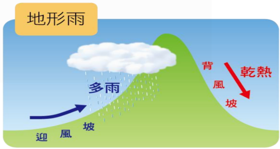
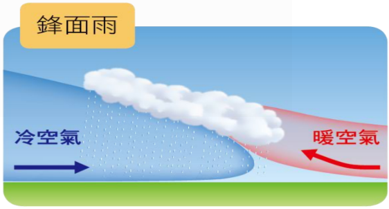
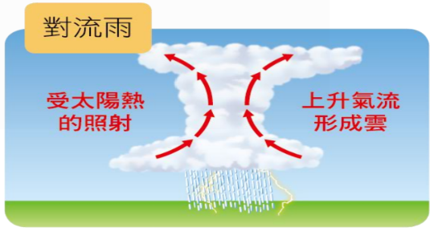

deck:: 社會一上::第五課-今天的天氣如何？

- # 天氣與天氣因子
	- 定義 #card
	  id:: 62c4f260-bd44-47a9-b658-a053e612c158
		- 一地**短**時間的大氣狀況及其變化
	- ## 天氣現象
		- 因地表空氣受到地面環境影響，具有不同溫度、溼度和密度
	- ## 天氣因子
		- ### 氣溫
			- 大氣的溫度
			- 以攝氏($$°C$$)或華氏($$°F$$)
			- #### 影響因子 #card #incremental
				- 日照的長短
				- 角度
				- 地勢高度
				- 隨著季節變化改變
				- 緯度或高度增加而遞減
		- ### 氣象量儀器
			-
		- ### 降水
			- 遇冷，使空氣中的水氣凝結成液體
			- 包含雨、雪、冰雹
			- #### 類型
				- 地形雨
					- {:height 160, :width 273}
					- 溼氣遇到山地
					- 沿地勢上升，氣溫降低，水氣凝結
					- 迎風坡多雨
					- 背風坡乾燥少雨
				- 鋒面雨
					- {:height 184, :width 340}
					- 冷暖性質不同的氣團相遇 -> 鋒面
					- 暖空氣隨鋒面上升，凝結致雨
					- 特性 -> {{cloze 雨時長、雨區大::a、b}}
				- 對流雨
					- {:height 166, :width 269}
					- 日照強烈使水氣蒸發
					- 水氣到高空遇冷，凝結致雨
					- 特性 -> {{cloze 雨時短、雨區小、強度大::a、b、c}}
					- 午後雷陣雨為此類型