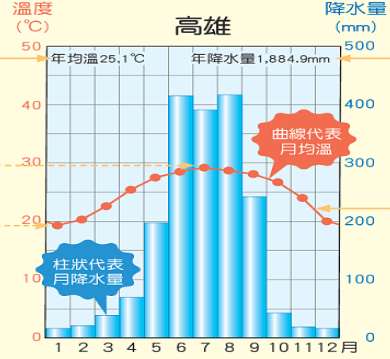

deck:: 社會一上::第五課-臺灣的氣候有什麼特色

- # 氣候圖組成
	- 
	- ## 年均溫 #card
		- 一年十二個月月均溫的平均值
	- ## 年降水量 #card
		- 一年十二個月的總和
	- ## 年溫差 #card
		- 最暖月均溫減去最涂月月均溫
	- ## 月均溫 #card
		- 一個月中每日日均溫的平均值
- # 臺灣的氣候特色
	- ## 氣溫特微
		- 夏季全臺平地皆高溫，各地區氣溫差異 {{cloze 小}}
		- 南部因緯度較高，冬季時氣溫較北部 {{cloze 溫暖}}
		- 部分高山水氣充足時可見降雪 #card
			- 宜蘭縣太平山
	- ## 臺灣的降水特微
		- 山區降水量多於平地
			- 多為 {{cloze 地形}}雨
		- 南部夏雨冬乾，北部全年有雨
			- 北臺灣因面向 {{cloze 東北季風}}，呈現全年有雨
- # 臺灣的氣候災害
	- ## 夏季
		- 五、六月間經常有鋒面滯留
			- 梅雨
		- 午後雷陣雨
		- 颱風侵襲
	- ## 冬季
		- 亞洲北部的冷氣團南下
			- 可能造成寒流
				- **臺北**的最低氣溫降至10C以下
			- 影響人體健康
	- ## 冬季至隔年