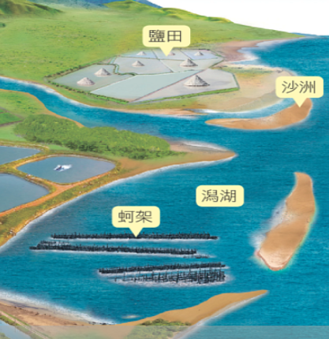
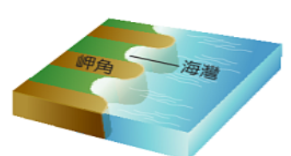

- # 海岸的類型
  collapsed:: true
	- ## 沙岸
		- 由海水、河流堆積作用所形成的沙質海岸
		- ### 特性
			- 海岸線平直
			- 海灘寬闊
			- 海底平坦
			- 海水較淺
		- ### 常見地形
			- 沙灘
			- 沙洲與潟湖
				- 
				- 沙洲：漂沙堆積於淺水地區
				- 潟湖：沙洲與陸地間的半封閉海域
	- ## 岩岸
		- 由山地或丘陵直接與海洋相鄰
		- ### 特色
			- 地形崎嶇
			- 海岸線曲折
		- ### 常見的地形
			- 岬角與灣澳
				- 
				- 岩層具有軟硬岩交互排列
					- 硬岩受侵蝕後->岬角
					- 軟岩受侵蝕後->灣澳
- # 臺灣的海岸與利用
	- ## 西部沙岸
		- 因較多平原，且有較多大河挾帶泥沙出海
			- 形容 {{cloze 沙岸}} 地形
		- **位置**：淡水河口至楓港
		- ### 用途
			- 沙岸 #card
				- 開闢為鹽田、魚塭
				- 海水浴場
			- 潟湖 #card
				- 沿海養殖
				- 港口興建
	-
	- ## 北部岬灣海岸
		- 因北部丘陵緊鄰海岸
		- ### 用途
			- 天然良港 #card
				- 因灣澳處受岬角屏障
				- 海水較深
	- ## 東部斷層海岸
		- 因位於板塊夜界帶，海岸線平直，多懸崖峭壁
		- 不利於開發
	- ## 恆春半島珊瑚礁海岸
		-
-