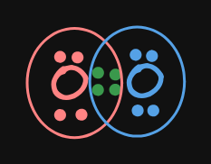

- 稱共用價電子"對"為鍵結
- ((661a37ab-8649-40d7-994f-60ad3d55ff18))
	- {:height 196, :width 267}
	- 綠色點點為 "價電子對"，因此 O2 為雙鍵
- 特殊鍵結
	- ### O3(1.5鍵)
		- O(2,6) + O(2,6) + O(2,6)
		- #### Attempt 1
			- 
			- 綠 O 就會有 **10** 顆價電子
		- #### Attempt 2
			- 不行如此()，因而只能 #.kanban
				- 
				- 
			- 在任意瞬間，"綠色 O" 的價電子在這兩種情況中 "震盪"，因此在 1 與 2 個鍵結中不斷切換
			- 取 "中間值" 1.5
-