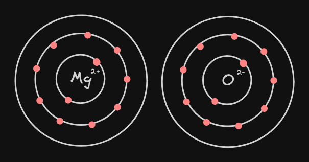

- 以 **得到、失去** 電子方式形成[[八隅體]]
- ## 吸引力來源
	- 以 **陰陽離子吸引力** 作為穩定原子之力
- ## 例
	- Mg (2,8,2) + O (2,6)
	- Mg 對於成為 [[八隅體]] **多了**兩顆電子
	- O 對於成為 [[八隅體]] **少了** 兩顆電子
	- 因此 "平衡" 過後，路易斯電子點式如下
		- {:height 124, :width 261}
			- #+BEGIN_PINNED
			  為什麼 Mg 外圍沒有電子但是 O 有？
			  #+END_PINNED
				- 因 Mg 原為(2,8,2)，而失去兩個電子過後
				  其最外層電子軌域 **沒有電子**，所以不用畫
				- 而 O 原為 (2,6)，在得到兩個電子之後
				  成為 (2,8)，所以需畫出**最外層電子軌域**之全部電子
		- {:height 206, :width 394}
- # Draws
  collapsed:: true
	- [[draws/2024-04-13-15-24-48.excalidraw]]
	- [[draws/2024-04-13-15-29-36.excalidraw]]