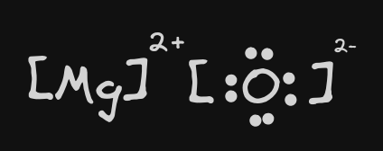

- 以 **得到、失去** 電子方式形成[[八隅體]]
- #
- ## 例
	- Mg (2,8,2) + O (2,6)
	- Mg 對於成為 [[八隅體]] **多了**兩顆電子
	- O 對於成為 [[八隅體]] **少了** 兩顆電子
	- 因此 "平衡" 過後，路易斯電子點式如下
		- 
		- 
- # Draws
  collapsed:: true
	- [[draws/2024-04-13-15-24-48.excalidraw]]
	- [[draws/2024-04-13-15-29-36.excalidraw]]